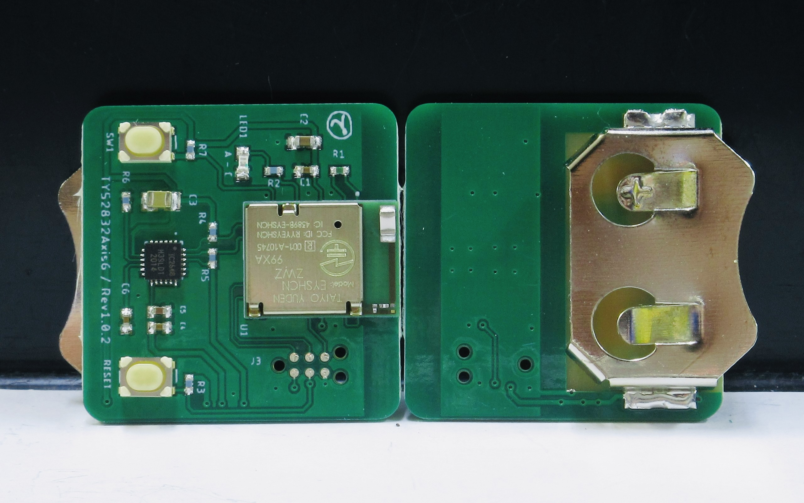

# ででんのホームページ

### 自己紹介
- ででん（屋号）と申します。BLEを少しやってます。  

|  TY52832Axis6（ふつうのサイズ）  |  TY52832Axis6_UltraSmall（超小さいサイズ）  |
| :---:| :---: |
|    |    |

### お店
  - [ででん屋](https://dedendendede.base.shop/)  

### おしながき
  - [Bluetooth5®︎と6軸センサー （ふつうの サイズ）](https://www.chocbanana.com/ty52832axis6)  
  - [Bluetooth5®︎と6軸センサー （超小さい サイズ）](https://www.chocbanana.com/ty52832axis6_ultrasmall)  
  - [Bluetooth5®︎と微小信号測定センサ ] ( comming soon... )  

### お話
  - [びーえるいー](https://www.chocbanana.com/ble)
  - [あいおーてぃー](https://www.chocbanana.com/nrf91)

