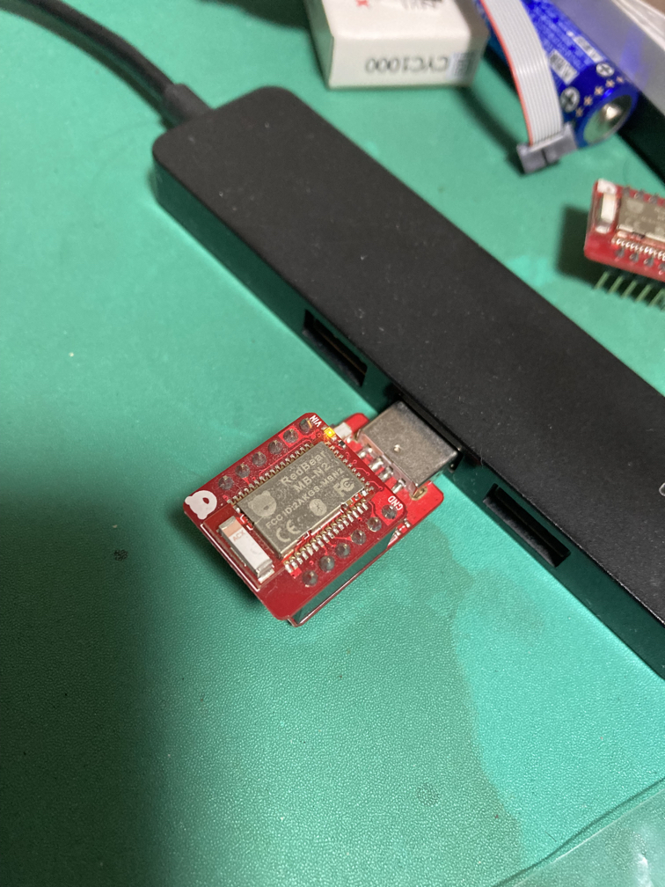
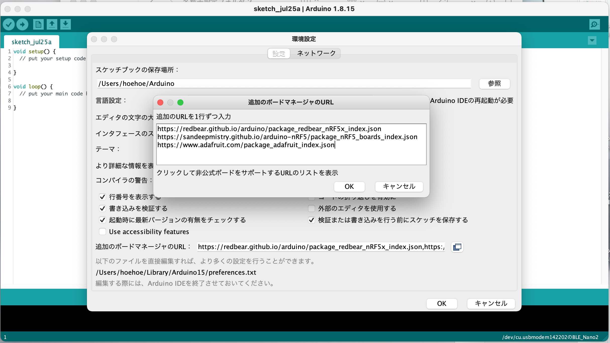
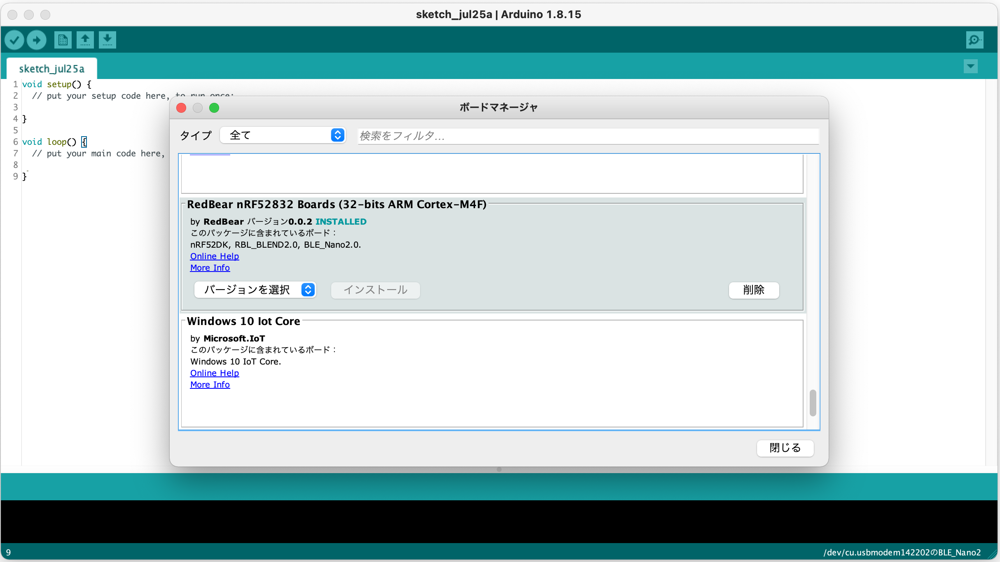
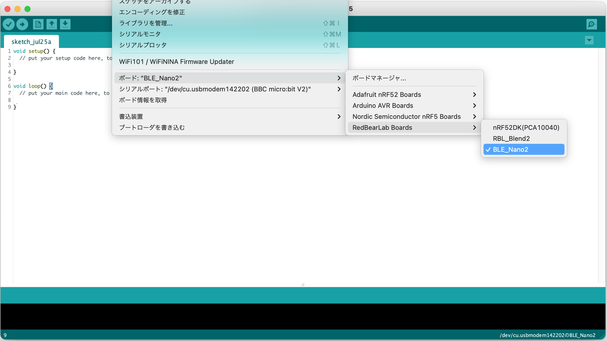
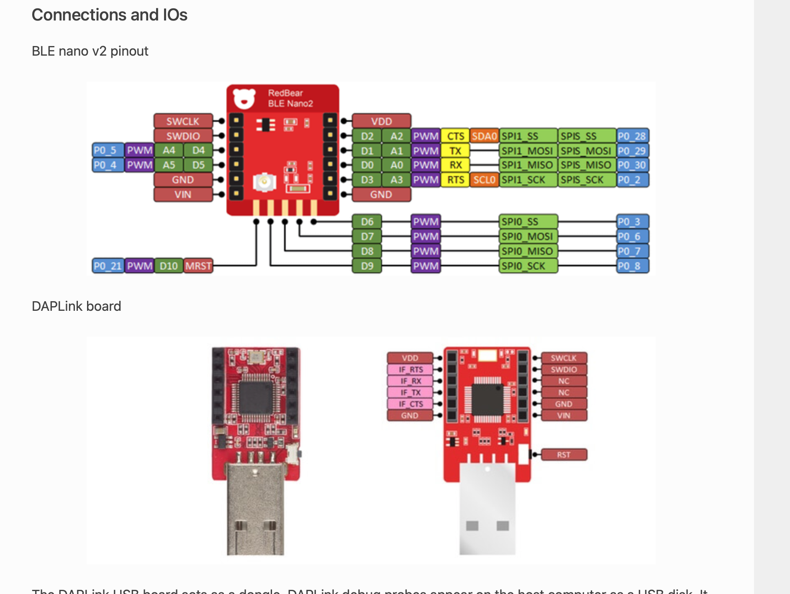
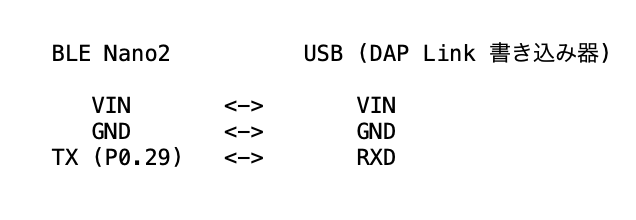
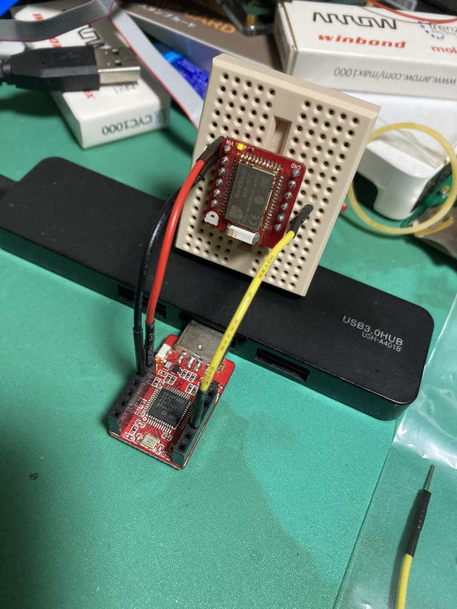
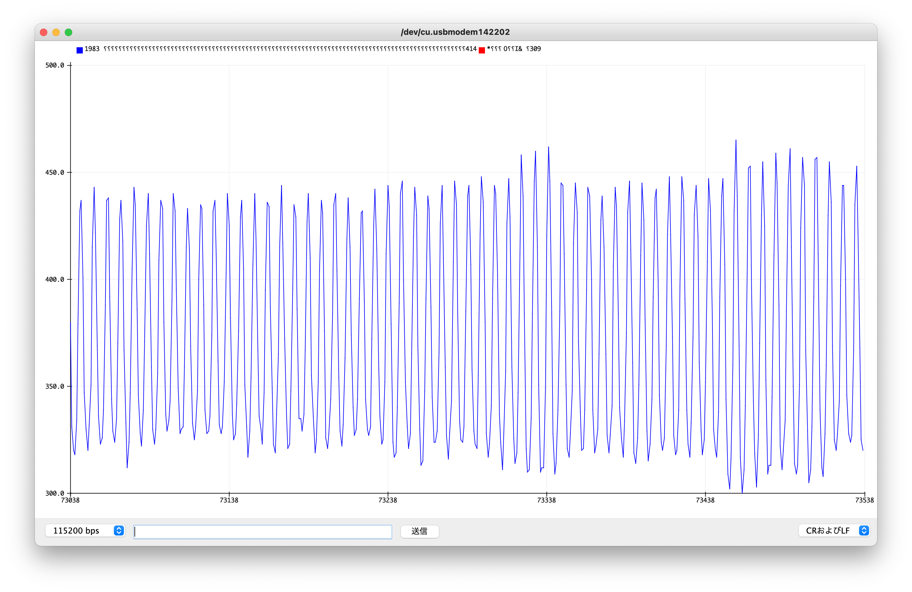

# ADC


## Hexファイルのダウンロード

[ADCのHexファイル](https://www.chocbanana.com/hex/saadc.hex) をデスクトップにダウンロードします。




ダウンロードしたsaadc.hexをBLE Nano v2 にドラッグ&ドロップします。


## Arduino IDE の設定確認
以下は、Arduino IDEのシリアルプロッタをBLE Nano v2で使用可能にするための手順です。
既にライブラリなどインストール済みであれば、大半はスキップしてもらって、BLE Nano v2を選択しておいてください。

Arduino IDE の設定でRedBearのindex.json を追加します。既に設定済みならスキップしてください。
```index.json
https://redbear.github.io/arduino/package_redbear_nRF5x_index.json
```




ボードマネージャから、RedBear nRF52823 Boards をインストールしてください。インストール済みの場合はスキップしてください。



BLE_Nano2 を選択します。




## BLE Nano v2 のピン配置などの確認



HEXファイルにて、AnalogピンはA2 のみを使用するようにしてあります。
Serial (UART) の出力は TX (P0_29) ピンから ボーレート 115200 で出力するようになっています。


3V供給は、USBのVIN ピンからBLE Nano2のVINピン に接続します。
BLE Nano2 の VDD ピンには接続しないでください。








Arduino IDE のシリアルプロッタを開くと、波形が表示されます。

アナログ値をADCへ入力する場合は、A2 ( P0_28 ) ピンへ接続してください。


## ADCの設定値

サンプリングは 500Hz （ 2ms ）、12bit 分解能としてあります。

サンプリングの設定は、マイコン内のタイマーを何ミリ秒で動作させるかで変えられます。が、整数値でしか設定できないため

2ms -> 500Hz
4ms -> 250Hz
5ms -> 200Hz

くらいの中から選択する必要があります。

