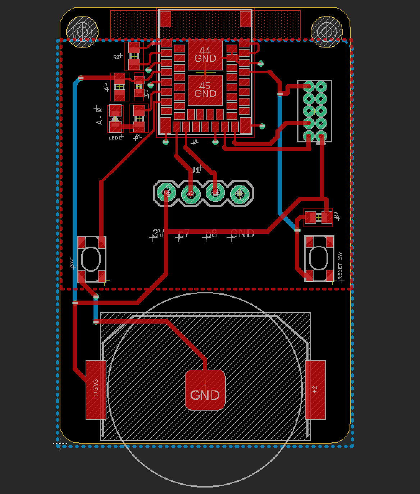

# Bluetooth 2021-04-02 までの備忘録


## BLE4.0からの流れ
Bluetooth LE(以下BLEと表記)4.0 〜 4.2 まで  

### BLEの基礎

低消費電力  
間欠通信  
再接続性が高い  
GATTプロファイル  
Bluetooth3までとの互換性は無い  

BLE4.0 - BLE Peripheral  
BLE4.1 - BLE Peripheral / Central  
BLE4.2 - GATT MTU / ATT MTU Exchange / LE Secure Connection  

Bluetooth3 までのを含むモジュールの場合、Dual mode。BLEだけの場合はSingle modeとなる  

### ターゲット
スマフォ・タブレットと繋げるというのがBluetooth - BLEの役割  

### メモ
**Bluetooth3まではSPPとかだったけど、BLEの場合はGATTベース**  
**データ構造を任意に定義できるようになった**  
**MAX 20byte(octet)まで送受信可能**  

**Peripheral Role でのアドバタイズのUUIDはビッグエンディアン（CentralからScanする際はPeripheralのadv UUIDを反転させてscanさせないとデバイスが見えない）**  

**GATTのRead / Notification / Indication それぞれどう振る舞う？**  
   - (ReadはGATT Clientから読む。NotificationはGATT Serverから送る。IndicationはNotification + ACK。IndicationはACK返すだけ)  

**Read時にサービスから読み込むGATT Characteristicの順番はどうなっている？**  

   - Characteristics を先にくっ付けた順番 (GattCharacteristic *ControllerChars[] = { &accelChar, &writeChar, };) で読まれる。Notificationの時も最初にくっ付けたcharacteristicが多く来る・・・のかな？)  

**BLEって、クラシックBluetoothのSPPみたいにシリアル通信できないの？**  
　- （iOSをClientにして、dispatch_queue_t centralQueue = dispatch_queue_create("hoge.fuga", DISPATCH_QUEUE_SERIAL); としてSerialQueueにしてReadすれば出来る。  
 - Notification / Indicationでは出来ない -順不同になる-   
 - 特に、コンカレントな接続で複数デバイス接続するともう順番ぐちゃぐちゃになるます。  

**BLE4.2 で ATT MTU Exchange を使用することにより、247オクテットまでは拡張できるようになった。**  
 - ただしアプリケーションより下のレイヤーでパケットが分割（L2CAPだと・・・なんだろ？フレーム？）されて送信されたりするし、その辺りは物理層とSoftDeviceなどの下位レイヤーの実装に依る。  
 - あと、デバイスでMTUを247にしてもiOSとのMTU交換時にiOS側が決めるので、iOSのバージョンによっては185になったりします。  
 - そうなると結局中途半端なので、データ長は128など区切りのいいとこで区切るか、もしくはGATT Clientでデータはくっ付けるので、データ長が分かれば受信側の最大長のData Lengthで送信しておけばいいです  


**Readの時にGATT Characteristicの読み込み（複数Readしていると）処理が追いつかないよ！？**  
   - (ReadするCharacteristicの数を減らすか、複数のPeripheralに分けましょう。)  

**センサーが速すぎて、BLEのコネクションインターバル内に収まらない**  
　- （512Hzとかのセンサーをくっ付けると、コネクションインターバルの最小値7.5msで追いつけないので、配列や構造体に複数サンプル載せましょう。）  

**開発中にGATTを変えると、iPhoneのBluetoothをオン・オフしないとダメだけど、service changedっていうCharacteristicもあるようです。**  
　- でもペアリングしていると、ペアリング情報を削除してBTをオン・オフしないとダメなので、微妙です。もう、BTオン・オフすれば良いんじゃないかな・・・。  

**ペアリングの情報がiPhoneに残っていると、BLEデバイスのHexファイルを書き換えた時、iPhoneのBluetoothをON/OFFしてもキャッシュが残ったままでハマる**  
  - ペアリング情報を削除後、iPhoneのBluetoothをON/OFFしましょう  

**パケット落ちって分かるの？**  
　- CRCは付いてるけど、エラー訂正はBluetooth5のCODEDを使うしか無い。  

**受信側ではちゃんとバッファリングしような。**  


**ペアリングとボンディングって違うの？？？（何が違うの？どう違うの？？？**
   - めっちゃ大雑把に。鍵交換をするのがペアリング。鍵を保存するのがボンディング（っていうらしいです）  
   - 両方を含めた意味で、ペアリングと呼ぶことが多いらしいです。  


**GAPとGATT**  

**GAP**  
　 - 役割（Role）・デバイス名などBLEデバイス全体に関わるパラメータを設定します。  

**GATT**  
　- データの定義と振る舞いを任意に設定できます。  
　- Bluetooth SIGによってあらかじめ決められた16bit UUIDのプロファイルもありますが、開発者が加速度センサーなどを繋いでスマートフォンなどにセンサー値を送信したりする時、任意のデータ構造とRead/Write/Notification/Indicationなどの振る舞いを設定できるのが GATTプロファイルになります(128bit UUIDね)。  

**GATT Server / GATT Client**  
   - データを持っている方がサーバー。データを受け取る方がクライアント。  
   - BLEでは通常、（センサーの）データを持っているBLEデバイスがサーバーになる事が多い。  
   - L2CAPのレイヤーではマスター・スレーブと言ったりするらしいけど、レイヤーが違うと呼び方が違いますよ。という事だそうです。  


**Security Manager**  
   - BLEではペアリングは無い・・・という解説を見かけたりすることもありますが、スマートフォンとBLEデバイスを１対１で接続する場合にペアリング（及びボンディング）した後、接続させる事もできます。  
   - その際に鍵の交換などの処理を司っているのがSecurity Managerになります。  
   - NFCを利用したOOBペアリングというのもあります。  

**ANCS(Apple Notification Center Service)**  
   - スマフォ(iPhone/iPad)・BLEデバイス連携でよくある、スマフォ(iPhone/iPad)の通知情報をBLEデバイスに伝える仕組み・・・ですが、これは少々特殊で、iPhoneとBLEデバイスが両方Peripheral Roleです。  
   - つまり、Roleとしては両方PeripheralですがGATT ServerとGATT Clientが逆になっている・・・ということです。  

## Bluetooth 5
2018年 3月時点での話のまとめ  

Nordic semiの場合、nRF51822 及び nRF52xxx  
SoftDevice駆動。工藤ちゃうで駆動やで。  

nRF51/52共、BLEの電波以外の電波も吹けます。ANT+ とか micro:bitみたいにRadio（無線）とか
nRF52840は 802.15.4 も対応  

大雑把にまとめると  

1M PHY / 2M PHY(192kbs / 256kbs) による（BLE4.2までと比べて）高速通信（１対１なら）  
Long Range  
アドバタイズメントパケットの拡張  

但し、これらは必須ではなくErrataに対応していればBluetooth5となる点に注意が必要  
Bluetooth SIG認証は 最低限Bluetooth 4.2に対応していないと取得出来ないように変更されました。  

### Bluetooth5 対応MCU 
**がれすたさんツッコミありがとうございます  

（Nordic Semiの場合。他社さんも色々あるけど、有りすぎるのとソフトウェアの方知らないんでとりあえずNordic限定で）  

nRF52832 - RAM  32 / 64KB 64MHz Cortex-M4F  
nRF52805  （しらない）  
nRF52810 - RAM       24KB 64MHz Cortex-M4 値段が nRF52832の半分くらい？ 廉価版  
nRF52811　(しらない)  
nRF52840 - RAM      256KB 64MHz Cortex-M4F  5.5V  
nRF52833 - ・・・ AoA / AoD Bluetooth5.2 対応  
nRF5340 - でゅあるこあのスゴイやつ！！ <- New  

まぁ、いいやめんどくさい、スペックシート見てくれ。  
で、nRF51とは物理層が異なるので色々可能になったそうな  

だーーーーかーーーらーーーーーーー安いって理由でやるとソフトウェアが困るんだよーーーーーーーーーーー！！！！！  
メモリー足りねーんだよーーーーーばーかばーかばーかばーかばーかばーかばーかばーかばーか。って言うのも忘れずに  


### ハードウェア
あー、黙ってnRF52使ってください。今nRF51でやる必要は無いハズです。  
全体のコストバランス見ようね。  

Adafruit Feather nRF52 Bluefruit LE  
太陽誘電の開発用基板  
Nordic nRF52-DK  

この中でサクっと買えるのは Adafruit Feather nRF52 Bluefruit LE です  
仕事でやるなら太陽誘電のボードだとピン配置がDKボード互換である場合が多いので、これかなぁ  
ただ選択するボードによって、外部クロックのクリスタルが非搭載だったりするので選択を間違うと痛い目を見ます  

初心者は Adafruit Feather nRF52 Bluefruit LEかな  
Nordicの 52-DKボードは国内の電波法の技適が通っていないため、電波暗室などでなら使えますが通常の場所では電波法違反になるので使わないでください  

某秋月電子で販売されている AE-TYBLE16 は nRF51822 なので nRF5 SDKは 12 までしか対応しておりません。nRF51822はLEDを点灯させるために FETを別途繋がないと 0.5mA までしかドライブ出来ませんのでご注意ください。あとSWO・・・  


### nRF52840
USBも載りましたんで、もうnRF52840で行きましょう。そうしましょう。  

### nRF5340
デュアルコアになって更に省電力でパワーアップ！！もうこれにしましょう。  

### BLE over 6LoWPAN
 nRF5 SDK v17 からBLE 6LoWPANのサンプルが削除されました  


### Bluetooth5
データ長が決まったのを2Mbpsで高速に送るなら、低消費電力  
そうじゃないなら、クラシックと変わらない。らしい。（データ送信し終わったら、ちゃんとsleepしよう）  

なんだけど、結局 MCU内のハードウェア実装とStack内のソフトウェア実装に依存するんですよ・・・  
アプリケーションからは命令を叩くだけだから・・・  


Long Range  
電波損失の許容範囲が4倍になった  
低スループット  
電波の回り込み  
繋がりにくかったとこに繋がるように、がLong Rangeの目的  
Nordic測定で、室内で色々壁とかにぶち当たって80m くらいだって。  

Advertising Extensions  
アホやろ・・・（アドバタイズメント・パケットを255オクテットまで拡張出来るようになったので、6軸センサーのデータをブロードキャストのパケットに含む事が出来たりします。が、アドバタイズを20msで送信するならともかく、1sec固定でやったらセンシングにならんやろ・・・ってなります。あとプライバシー。パケット暗号化せず更にブロードキャストとか正気か？？？って話です）  

PHY  
1M PHY / 2M PHY / CODED PHY  


メッシュ  

Meshの前に  
Scatternet （スター型同士のトポロジ）  
拡張性は難しい  
信頼性もない  

Mesh  
信頼性  
自己回復、冗長性  
リレーなど  

nRF52840 でサポートするMesh  
ジグビー、すれっど、BLEのメッシュ  

Bluetooth Meshの種類  
Advertisingベアラー  
接続しない  
ブロードキャスト  

GATTベアラー  
ADVベアラーにスマフォを参加させるためにコンカレントな感じでGATTベース  

Bluetooth Mesh 結論  
今後に期待だよ  
コネクティッド型が出るまで我慢よ  


THREAD  
IPv6ベース  
100ms未満のレイテンシ  
ネットワークリーダーがダウンした時に自己判断して新リーダーを決定し、自己修復する機能付き  

THREADはParticleがやってたけど撤退しました。  


Zigbee  
3.0 stack  
日本のアライアンス消えちゃった？  

どっちが良いのか  
どっちもまだ低消費電力じゃないので人類には早すぎる！  

### 個人的補足的メモ 
要は、2.4GHzですよ。


### BT5.1の追加機能について;
• Angle of Arrival / Angle of Departure  
• Gatt caching  
• Advertising channel index  
• Periodic Advertising Sync Transfer  
• Sleeve of minor enhancements  

AoA、位相だから頑張ってね！！！！（またかよ・・・どうすればいいんだよ・・・全部ソフトウェア任せかよ・・・  

BT5.1 で Periodic Advertising Sync Transfer（定期的なアドバタイジングと同期した転送）機能が載りました。  
Gatt cachingもかなり有効に効いてます。  
BT5.2 で LE Audio が発表されました。  


### Bluetooth SIG認証（最終製品登録）
取得しなければならない。  

Nordic semiの場合、MCUとSoftDeviceのバージョンそれぞれに応じてSIG認証を取っているので、選択するMCUとSoftDeviceのバージョンの組み合わせで申請する（んだと思う）  


## ソフトウェアの開発環境

### Arm Mbed
MbedOS / オンラインコンパイラ/MbedStudioで開発出来るみたいです（Bluetooth StackはCordio Stackになります）  

### Arduino
  Adafruit Feather nRF52 Bluefruit LEもGitHubにそれぞれパッケージとして上がってますので、こちらをArduino IDEにインストールすればいいです  

[ Adafruit Feather nRF52 Bluefruit LE ]  https://github.com/adafruit/Adafruit_nRF52_Arduino  


### nRF5 SDK
本命はこちら。Nordic semiのSDK。だいたいこのSDKをラップしてArduinoで使えるようにしてあったりするのですが、最新バージョンのSDKはNordicからリリースされるので、Arduinoでのライブラリはちゃんと更新されれば良いのですが、コミュニティの動きに寄るのでその辺りは不透明です  

IDEはKeil ARM-MDK / Segger Embedded Studio / IAR Embedded Workbench など Arm-cc / GCC-Toolchain  

### nRF Connect SDK
今やってる。なかなか良いよ。  

### ちょっと良いところ
どのソフトウェア環境で作成しても、ハードウェア構成が同じなら動きます。I2C / SPI / UARTのピン配置 は 固定ではなく、任意割り当てが基本的に可能なので  
まぁ、UARTがFTDIとかDAP Linkとかに繋がってたらダメだと思いますけど。  
逆に言うと、ピン割り当てが任意にできるので、GPIOで空いてるピンにI2CやSPIを割り当てたりできます。便利です  

### ハードウェア実装
LED1個（抵抗も忘れずに）、GPIOボタン1個、リセットボタン１個、32KHzクリスタル（水晶振動子）がモジュールに実装されてない場合はそれも付けといて。  

### ハードウェア(MCU)
1年ごとにスペックは倍になります！  

### ソフトウェア
もう全部 nRF Connect SDKでいいや。  


どうやら nRF Connect SDK v1.5.0 から nRF52 のサポートも入ったっぽい（ように見える）んですよね・・・  


### iOS13とか
iPhone7 以降の端末はiOS13 (13.2？もうアップデートしちゃったからよく分かんない)でATT MTUが185を越えて200byte以上のパケットも扱えるように（iOSデバイス内のコンボチップとファームウェアに依存します）。  

nRF52が対向の場合、MTUは 247 - 3 = 244 まで扱えるので、そのくらいなら行けそう。とりあえず iPhone7（iOS13.2） <-> nRF52832 で 208byte パケットのやり取りが可能なことは確認。  

### 電池持ちとスループット

電池(電源周りの設計)はハードウェア設計に依存します。nRF52832の場合はコンデンサは C3 まで載せた方がいいけど、その辺は選択するMCU依存なので、各MCUのボード設計がモジュールメーカー（Nordicのパートナー企業様）から出ているので、そちらを参考にしてください（参考にしてくださいというか、そのまま回路図を起こしてください）

スループットも10KB/secは出ます。最新のiPadで20KB/secくらいだったかなぁ・・・（ここうろ覚え  
次の nRF5340 はデュアルコアでネットワークコアがあるので更に省電力に！とても楽しみ！！  


### スループットとかデータ長とか

スループットとかデータ長とかコネクションインターバルとかは クライアント側（ iOS ）が決めますが、その際どこまで出るかとかは iOS デバイス内のコンボチップの性能に依存していると思われるので、最新でリリースされている iOS デバイスとエントリーモデルでリリースされている iOS デバイスとでは発揮される性能に差が生じる可能性があります  

### サポート
技術サポートを受けたいのであれば、サポートを受けられるように選択をしましょう。  


# Getting Started with nRF5 SDK on Nordic nRF52832

### Introduction
とてもツラたん  
製品を作る時は nRF5 SDKで担保します。  

### Installing the SDK  
Nordic semi. のWebサイトから SDKの Zipファイル nRF5_SDK_x.x.x_xxxxxxx.zip (for example, nRF5_SDK_v17.0.2_1a2b3c4.zip) と併せて使用するSoftDeviceをダウンロードします。  
SoftDeviceは利用する nRF52 MCUの種類とSoftDeviceが対応している機能によって S112, S113, S132, S140 などを適宜選択します。  

ダウンロードできたらzipファイルは任意の場所に展開します（スペースを含むフォルダに展開しない方がいいかも知れません）  

アプリケーション開発に使用できる IDE（統合開発環境）は Keil ARM MDK, IAR, Segger embedded studio(こちらは Nordic editionもあります) などがありますので、好きな IDE を選ぶことが可能です。  


printf みたいな標準出力マクロの NRF_LOG_INFO で頑張ります  
floatを出力する時はハマりますので頑張ってください  

```
NRF_LOG_INFO("  X: " NRF_LOG_FLOAT_MARKER "", NRF_LOG_FLOAT(event->data.quaternion.quat[0]));
```

### nRF5 SDK の BLE のサンプル
ble_app_uart のプロジェクトを丸ごとコピーして、それをベースに作ります。 BLEのService / Characteristicsも併せて設計し直します  


# Getting Started with Zephyr RTOS on Nordic nRF52832

### Introduction

ん〜〜〜〜〜〜〜〜〜〜〜〜〜〜〜〜〜〜〜〜〜〜〜〜  


1. MbedOS <- ツラい  
2. Arduino <- （わからない  
3. Nordic SDK <- ﾁｮｯﾄﾃﾞｷﾙけど、とてもツラい  
  

これからはZephyrだ！！！！  

ぜふぁーぜふぁー。  


### インストール
公式のドキュメント見れば1発。  
https://docs.zephyrproject.org/latest/  

インストールは既に終えているものとします。  
いちおう書きましょうか。  

```Install

/usr/bin/ruby -e "$(curl -fsSL https://raw.githubusercontent.com/Homebrew/install/master/install)"

brew install cmake ninja gperf ccache dfu-util qemu dtc python3

pip3 install --user west

wget gcc-arm-none-eabi-7-2018-q2-update-mac.tar.bz2のURL

tar jxf gcc-arm-none-eabi-7-2018-q2-update-mac.tar.bz2
sudo mv gcc-arm-none-eabi-7-2018-q2 /usr/local/gnuarmemb


cd ~
west init zephyrproject
cd zephyrproject
cd zephyr
git checkout v1.14.0
cd ..
west update

pip3 install -r ~/zephyrproject/zephyr/scripts/requirements.txt

/usr/local/gnuarmemb/bin/arm-none-eabi-gcc --version
arm-none-eabi-gcc (GNU Tools for Arm Embedded Processors 7-2018-q2-update) 7.3.1 20180622 (release) 

vi ~/.zshrc
set ZEPHYR_BASE=~/zephyrproject/zephyr
set ZEPHYR_TOOLCHAIN_VARIANT=gnuarmemb
set GNUARMEMB_TOOLCHAIN_PATH=/usr/local/gnuarmemb

cd ~/zephyrproject/zephyr
source zephyr-env.sh


cd samples/hello_world
west build -b nrf52_pca10040
west flash

```


### Hello world
cd \$ZEPHYR_BASE/samples/basic/blinky  
west build -b nrf52_pca10040  
west flash  

で Hex ファイルが書き込まれ、Lチカが実行されます。  
お疲れさまでした。  

### MPU6050
続いて、MPU6050を使用してI2Cですね。  

\$ cd \$ZEPHYR_BASE/samples/bluetooth  
\$ cp peripheral peripheral_mpu6050  

適当に peripheral とかをコピーしてください。それを改変します。  
コピーしたら、src/servicesディレクトリを作って、その中にble_mpu.hとble_mpu.cを作ります。  

MPU6050のライブラリは既にZephyrの中にありますので、興味があったら見てみてください。  

nRF52とMPU6050のI²Cのピンの接続は  

```i2c
&i2c0 {
	status = "ok";
	sda-pin = <26>;
	scl-pin = <27>;
};
```

とデフォルトで設定されているので、SDAが26, SCLを27に繋いでください。  


```CMakeLists.txt
cmake_minimum_required(VERSION 3.8.2)
include($ENV{ZEPHYR_BASE}/cmake/app/boilerplate.cmake NO_POLICY_SCOPE)
project(NONE)

target_sources(app PRIVATE
  src/main.c
  src/services/ble_mpu.c
)

zephyr_library_include_directories($ENV{ZEPHYR_BASE}/samples/bluetooth)
```


```prj.conf
# Incresed stack due to settings API usage
CONFIG_SYSTEM_WORKQUEUE_STACK_SIZE=2048
CONFIG_STDOUT_CONSOLE=y

CONFIG_BT=y
CONFIG_BT_DEBUG_LOG=y
CONFIG_BT_SMP=y
CONFIG_BT_SIGNING=y
CONFIG_BT_PERIPHERAL=y
CONFIG_BT_ATT_PREPARE_COUNT=2
CONFIG_BT_PRIVACY=y
CONFIG_BT_DEVICE_NAME="Zephyr Peripheral Sample Long Name"
CONFIG_BT_DEVICE_APPEARANCE=833
CONFIG_BT_DEVICE_NAME_DYNAMIC=y
CONFIG_BT_DEVICE_NAME_MAX=65

CONFIG_BT_SETTINGS=y

CONFIG_BT_RX_BUF_LEN=258
CONFIG_BT_GATT_CLIENT=y
CONFIG_BT_ATT_TX_MAX=10
CONFIG_BT_ATT_PREPARE_COUNT=2
CONFIG_BT_CONN_TX_MAX=10
CONFIG_BT_L2CAP_TX_BUF_COUNT=10
CONFIG_BT_L2CAP_TX_MTU=247
CONFIG_BT_L2CAP_DYNAMIC_CHANNEL=y
CONFIG_BT_CTLR_PHY=y
CONFIG_BT_CTLR_PHY_2M=y
CONFIG_BT_CTLR_RX_BUFFERS=2
CONFIG_BT_CTLR_TX_BUFFERS=10
CONFIG_BT_CTLR_TX_BUFFER_SIZE=251
CONFIG_BT_CTLR_DATA_LENGTH_MAX=251
CONFIG_BT_CTLR_ADVANCED_FEATURES=y


CONFIG_FLASH=y
CONFIG_FLASH_PAGE_LAYOUT=y
CONFIG_FLASH_MAP=y
CONFIG_FCB=y
CONFIG_SETTINGS=y
CONFIG_SETTINGS_FCB=y

##########
# for I2C 

CONFIG_I2C=y
CONFIG_I2C_NRFX=y
CONFIG_I2C_0_NRF_TWIM=y
CONFIG_I2C_INIT_PRIORITY=60
CONFIG_I2C_0=y
CONFIG_MPU6050_I2C_MASTER_DEV_NAME="I2C_0"

##############
# for MPU6050

CONFIG_SENSOR=y
CONFIG_MPU6050=y
```

~~~c
/* main.c - Application main entry point */

/*
 * Copyright (c) 2015-2016 Intel Corporation
 *
 * SPDX-License-Identifier: Apache-2.0
 */

#include <zephyr/types.h>
#include <stddef.h>
#include <string.h>
#include <errno.h>
#include <misc/printk.h>
#include <misc/byteorder.h>
#include <zephyr.h>

#include <settings/settings.h>

#include <bluetooth/bluetooth.h>
#include <bluetooth/conn.h>
#include <bluetooth/gatt.h>
#include <bluetooth/hci.h>
#include <bluetooth/uuid.h>

#include <sensor.h>
#include <gpio.h>

#include <stdio.h>
#include "services/ble_mpu.h"

// Buff
#define OUTPUT_BUF_SIZE sizeof(float)*6
static u8_t sensor_vals[OUTPUT_BUF_SIZE];


static int abs(int i) { return (i >= 0) ? i : -i; }

static inline double my_atof(const char* instr)
{
    double rtn;
    double base;
    
    for(rtn=0.0; *instr!='.'; instr++){
        if (*instr == '\0'){
            return rtn;
        }
        if (*instr >= '0' && *instr <='9'){
            rtn = rtn*10+(*instr-'0');
        }
    }
    instr++;
    
    for(base=0.1;*instr!='\0';instr++,base/=10.0){
        if (*instr >= '0' && *instr <='9'){
            rtn += base*(*instr-'0');
        }
    }
    
    return rtn;
}

static inline float out_ev(struct sensor_value *val)
{
    
    bool flag = false;
    if(val->val2<0 || val->val2<0){
        flag = true;
    }
    
    val->val1 = abs(val->val1);
    val->val2 = abs(val->val2);
    
    char buf[30];
    sprintf(buf, "%d.%06d", val->val1, val->val2);
    my_atof(buf);
    
    float ans = (float)my_atof(buf);
    
    if(flag == true){
        return (-ans);
    }
    
    return ans;
}

/* Custom Service Variables */
// sensor
static struct device* dev_mpu6050;

static struct bt_conn* p_conn = NULL;
static struct bt_gatt_exchange_params exchange_params;


//BLE Advertise
static volatile u8_t mfg_data[] = { 0x00, 0x00, 0xaa, 0xbb };

static const struct bt_data ad[] = {
    BT_DATA_BYTES(BT_DATA_FLAGS, (BT_LE_AD_GENERAL | BT_LE_AD_NO_BREDR)),
    BT_DATA(BT_DATA_MANUFACTURER_DATA, mfg_data, 4),
    
    BT_DATA_BYTES(BT_DATA_UUID128_ALL,
                  0xf0, 0xde, 0xbc, 0x9a, 0x78, 0x56, 0x34, 0x12,
                  0x78, 0x56, 0x34, 0x12, 0x78, 0x56, 0x34, 0x12),
};

static void exchange_func(struct bt_conn *conn, u8_t err,
                          struct bt_gatt_exchange_params *params)
{
    struct bt_conn_info info = {0};
    
    printk("MTU exchange %s\n", err == 0 ? "successful" : "failed");
    
    err = bt_conn_get_info(conn, &info);
    if (info.role == BT_CONN_ROLE_MASTER) {
        
    }
}

static void connected(struct bt_conn *conn, u8_t err)
{
    if (err) {
        printk("Connection failed (err %u)\n", err);
    } else {
        printk("Connected\n");
        p_conn = conn;
        
    }
}

static void disconnected(struct bt_conn *conn, u8_t reason)
{
    printk("Disconnected (reason %u)\n", reason);
    p_conn = NULL;
}

static struct bt_conn_cb conn_callbacks = {
    .connected = connected,
    .disconnected = disconnected,
};

static void bt_ready(int err)
{
    if (err) {
        printk("Bluetooth init failed (err %d)\n", err);
        return;
    }
        
    printk("Bluetooth initialized\n");
    
    //ble service init.
    bmpu_init();
    
    if (IS_ENABLED(CONFIG_SETTINGS)) {
        settings_load();
    }

    exchange_params.func = exchange_func;
    err = bt_gatt_exchange_mtu(NULL, &exchange_params);
    
    err = bt_le_adv_start(BT_LE_ADV_CONN_NAME, ad, ARRAY_SIZE(ad), NULL, 0);
    if (err) {
        printk("Advertising failed to start (err %d)\n", err);
        return;
    }
    
    printk("Advertising successfully started\n");
}

// Sensor data
void update_sensor_data()
{
    struct sensor_value sen_val[3];

    sensor_sample_fetch(dev_mpu6050);
    sensor_channel_get(dev_mpu6050, SENSOR_CHAN_ACCEL_XYZ, sen_val);
    
    float out_accel_x = out_ev(&sen_val[0]);
    float out_accel_y = out_ev(&sen_val[1]);
    float out_accel_z = out_ev(&sen_val[2]);
    
    printf("acc:   x: %.6f    y: %.6f    z: %.6f\n", out_accel_x, out_accel_y, out_accel_z);
    
    sensor_channel_get(dev_mpu6050, SENSOR_CHAN_GYRO_XYZ, sen_val);
    
    float out_gyro_x = out_ev(&sen_val[0]);
    float out_gyro_y = out_ev(&sen_val[1]);
    float out_gyro_z = out_ev(&sen_val[2]);
    
    printf("gyr:   x: %.6f    y: %.6f    z: %.6f\n", out_gyro_x, out_gyro_y, out_gyro_z);
    
    memset(sensor_vals, 0, sizeof(sensor_vals));
    
    memcpy(&sensor_vals[sizeof(float)*0], &out_accel_x, sizeof(float));
    memcpy(&sensor_vals[sizeof(float)*1], &out_accel_y, sizeof(float));
    memcpy(&sensor_vals[sizeof(float)*2], &out_accel_z, sizeof(float));
    memcpy(&sensor_vals[sizeof(float)*3], &out_gyro_x, sizeof(float));
    memcpy(&sensor_vals[sizeof(float)*4], &out_gyro_y, sizeof(float));
    memcpy(&sensor_vals[sizeof(float)*5], &out_gyro_z, sizeof(float));

}


void main(void)
{
    /* Set LED pin as output */
    struct device* port0 = device_get_binding("GPIO_0");
    gpio_pin_configure(port0, 17, GPIO_DIR_OUT);
    
    // flash  LED
    gpio_pin_write(port0, 17, 0);
    k_sleep(500);
    gpio_pin_write(port0, 17, 1);
    k_sleep(500);
    
    // sensor
    dev_mpu6050 = device_get_binding("MPU6050");
    printk("dev %p name %s\n", dev_mpu6050, dev_mpu6050->config->name);
    
    k_sleep(500);
    
    // set up BLE
    int err;
    err = bt_enable(bt_ready);
    if (err) {
        printk("Bluetooth init failed (err %d)\n", err);
        return;
    }
    
    bt_conn_cb_register(&conn_callbacks);
    
    while (1) {
        if(p_conn != NULL){
            if(bmpu_is_notify()){
                update_sensor_data();
                bmpu_notify(p_conn, sensor_vals, OUTPUT_BUF_SIZE);
            }
        }
        k_sleep(100);
    }

}
~~~

~~~c
// ble_mpu.h
/** @file
 *  @brief BAS Service sample
 */

/*
 * Copyright (c) 2016 Intel Corporation
 *
 * SPDX-License-Identifier: Apache-2.0
 */

#include <zephyr/types.h>
#include <stddef.h>
#include <string.h>
#include <errno.h>
#include <misc/printk.h>
#include <misc/byteorder.h>
#include <zephyr.h>

#include <bluetooth/bluetooth.h>
#include <bluetooth/hci.h>
#include <bluetooth/conn.h>
#include <bluetooth/uuid.h>
#include <bluetooth/gatt.h>

#ifdef __cplusplus
extern "C" {
#endif

void bmpu_init(void);
bool bmpu_is_notify(void);
void bmpu_notify(struct bt_conn* conn, u8_t *p_vals, u16_t len);

#ifdef __cplusplus
}
#endif
~~~

~~~c
// ble_mpu.c

/*
 * Copyright (c) 2015-2016 Intel Corporation
 *
 * SPDX-License-Identifier: Apache-2.0
 */

#include "ble_mpu.h"

/* Custom Service Variables */
static struct bt_uuid_128 mpu_service_uuid = BT_UUID_INIT_128(
                                                      0xf0, 0xde, 0xbc, 0x9a, 0x78, 0x56, 0x34, 0x12,
                                                      0x78, 0x56, 0x34, 0x12, 0x78, 0x56, 0x34, 0x12);


static const struct bt_uuid_128 mpu_char_uuid = BT_UUID_INIT_128(
                                                          0xf1, 0xde, 0xbc, 0x9a, 0x78, 0x56, 0x34, 0x13,
                                                          0x78, 0x56, 0x34, 0x12, 0x78, 0x56, 0x34, 0x13);

static struct bt_gatt_ccc_cfg mpu_ccc_cfg[BT_GATT_CCC_MAX];

static volatile u8_t notifyEnable;

#define BT_BUF sizeof(float)*6
static u8_t mpu_vals[BT_BUF];

static void mpu_ccc_cfg_changed(const struct bt_gatt_attr *attr, u16_t value)
{
    notifyEnable = (value == BT_GATT_CCC_NOTIFY) ? 1 : 0;
}

//static ssize_t read_ct(struct bt_conn *conn, const struct bt_gatt_attr *attr,
//                       void *buf, u16_t len, u16_t offset)
//{
//    const char *value = attr->user_data;
//
//    return bt_gatt_attr_read(conn, attr, buf, len, offset, value,
//                             sizeof(mpu_vals));
//}
//
//static ssize_t write_ct(struct bt_conn *conn, const struct bt_gatt_attr *attr,
//                        const void *buf, u16_t len, u16_t offset,
//                        u8_t flags)
//{
//    notifyEnable = !notifyEnable;
//    return len;
//}

/* Vendor Primary Service Declaration */
static struct bt_gatt_attr attrs[] = {
    /* Vendor Primary Service Declaration */
    BT_GATT_PRIMARY_SERVICE(&mpu_service_uuid),
    
    BT_GATT_CHARACTERISTIC(&mpu_char_uuid.uuid,
                           BT_GATT_CHRC_NOTIFY,
                           BT_GATT_PERM_READ | BT_GATT_PERM_WRITE,
                           NULL, NULL, mpu_vals),
                           //read_ct, write_ct, mpu_vals),
    
    BT_GATT_CCC(mpu_ccc_cfg, mpu_ccc_cfg_changed),

};

static struct bt_gatt_service mpu_svc = BT_GATT_SERVICE(attrs);


void bmpu_init(void)
{
    bt_gatt_service_register(&mpu_svc);
}

bool bmpu_is_notify(void)
{
    return notifyEnable;
}

void bmpu_notify(struct bt_conn* conn, u8_t *p_vals, u16_t len)
{
    if(conn == NULL){
        return;
    }
    
    if(!notifyEnable){
        return;
    }
    
    if(len > BT_BUF){
        return;
    }
    
    memset(mpu_vals, 0, sizeof(mpu_vals));
    memcpy(mpu_vals, p_vals, BT_BUF);
    
    bt_gatt_notify(conn, &attrs[1], (u8_t *)mpu_vals, BT_BUF);
}
~~~

あとはLチカの時と同じように、west build / west flash 叩けば動きます。  

west build -b nrf52_pca10040  
west flash  

イゴイタ。  

やってみたら、めちゃくちゃ直感的でNordic SDKよりもはるかにコード量が少なくなります。
BLE / Blutooth部分に至っては、prj.conf に設定を書くだけ。exchangeのトコだけは一部関数を呼びますが。  

I²C などのセンサー周りさえしっかり押さえられればすごく楽チンぽんですよ。  

Zephyr RTOSは 2019/04 現在 v1.14 までリリースされていて、このバージョンでLTSにもなっています（そしてみんなダイスキ・オープンソース！）   

## Zephyr RTOS Programming ( I²C 編 )

書こうかどうしようか迷ったけど書いとこか。  
まぁ、ツラいよねっていうやつ。定番の。  

### Zephyr のセンサー周り

MPU6050のmain.c   

~~~c
/* main.c - Application main entry point */

/*
 * Copyright (c) 2015-2016 Intel Corporation
 *
 * SPDX-License-Identifier: Apache-2.0
 */

#include <zephyr/types.h>
#include <stddef.h>
#include <string.h>
#include <errno.h>
#include <misc/printk.h>
#include <misc/byteorder.h>
#include <zephyr.h>

#include <settings/settings.h>

#include <sensor.h>
#include <gpio.h>
#include <stdio.h>
#include <stdlib.h>

static inline float out_ev(struct sensor_value *val)
{
    
    bool flag = false;
    if(val->val2<0 || val->val2<0){
        flag = true;
    }
    
    val->val1 = abs(val->val1);
    val->val2 = abs(val->val2);
    
    char buf[30];
    sprintf(buf, "%d.%06d", val->val1, val->val2);
    
    float ans = (float)atof(buf);

    if(flag == true){
        return (-ans);
    }
    
    return ans;
}

//sensor
static struct device* dev_mpu6050;


// Sensor data
void update_sensor_data()
{
    struct sensor_value sen_val[3];

    sensor_sample_fetch(dev_mpu6050);
    sensor_channel_get(dev_mpu6050, SENSOR_CHAN_ACCEL_XYZ, sen_val);

    float out_accel_x = out_ev(&sen_val[0]);
    float out_accel_y = out_ev(&sen_val[1]);
    float out_accel_z = out_ev(&sen_val[2]);
    
    printf("acc:   x: %.6f    y: %.6f    z: %.6f\n", out_accel_x, out_accel_y, out_accel_z);
    
    sensor_channel_get(dev_mpu6050, SENSOR_CHAN_GYRO_XYZ, sen_val);
    
    float out_gyro_x = out_ev(&sen_val[0]);
    float out_gyro_y = out_ev(&sen_val[1]);
    float out_gyro_z = out_ev(&sen_val[2]);
    
    printf("gyr:   x: %.6f    y: %.6f    z: %.6f\n", out_gyro_x, out_gyro_y, out_gyro_z);
    
}


void main(void)
{
    // sensor
    dev_mpu6050 = device_get_binding("MPU6050");
    printk("dev %p name %s\n", dev_mpu6050, dev_mpu6050->config->name);
    
    k_sleep(500);
        
    while (1) {
        update_sensor_data();
        k_sleep(K_MSEC(1000));
    }
}
~~~

これ見た瞬間、アホか！！って思いますよね。  

Zephyrのセンサー関係のドライバは $ZEPHYR_BASE/drivers/sensor 以下に。サンプルはsamples/sensor以下にあるわけですが、大体が sensor.h を include してこんなようなコードを書くんだそうです。  

が、一応やり方は３つくらいあって、Sensor / Device Driver Model / I²C（直叩き？）になるんだそうです。しらんけど。  

### Sensor
要はね、最終的な結果はfloatで欲しい場合が多いんですよ。  
んで、sensorを使うと、sensor.hに  

```
struct sensor_value {
	/** Integer part of the value. */
	s32_t val1;
	/** Fractional part of the value (in one-millionth parts). */
	s32_t val2;
};
```

とかいう構造体になってて、加速度センサや温度センサの場合に仮数である整数部がval1に。小数部がval2に入ります。ちゃんとコメントに書いてありますね。読みましょうね。今読みました。  

変換しろって？？？？って思うじゃないですか。  

んで、s32_t ですよ。両方に符号付くじゃないですか。もうね。アホかと。  
だからout_ev関数みたいにアホな処理を自前で書かないといけないし、stdlibは必要最小限しか実装されてないからatof関数とか普通に呼ぶとコンパイルエラーになるし。  

だったら最初からfloatで値出せるように書くよ！！！書き方どこ！！！ってなりますよ。  

まだサンプルがあれば良いのですが、一から自分でドライバを書こうと思ったらこの書き方はちょっと無いかなって。最悪 * void が使えるのでね、でも * void なんて実務で書いたら、タヒね！！！ってマガオで言われるよきっと。  

sensor_channel_get の3番目の引数・・・（おっとこれ以上いけない  


### I²C 直叩き

これも無いかなって。  
$ZEPHYR_BASE/drivers/sensor 以下に収めるようにするのがZephyrでの作法・・・と見えますので。  
で、drivers/sensor 以下に配置した場合、センサーとmainの処理がそれぞれ別のスレッドで動くようです。  
起動した時にmainの処理よりも先にセンサーの処理が走って、その後mainが動きますね。  

### Device Driver Model
Device Driver Model ( device.h )を利用すると、過度なカプセル化や煩雑なコードにならなくて済みそうかなと。  

あと、MbedやArduinoやNordic SDKで書いたコードを利用しやすそうですし。  

$ZEPHYR_BASE/drivers/sensor 以下に書くのはSensorと同じ要領です。  

~~~c
//lsm9ds1.h
/*
 * Copyright (c) 2016 Intel Corporation
 *
 * SPDX-License-Identifier: Apache-2.0
 */

#ifndef ZEPHYR_DRIVERS_SENSOR_LSM9DS1_LSM9DS1_H_
#define ZEPHYR_DRIVERS_SENSOR_LSM9DS1_LSM9DS1_H_

#include <device.h>
#include <gpio.h>
#include <misc/util.h>
#include <zephyr/types.h>
#include <sensor.h>

typedef void (*lsm9ds1_sample_fetch_t)(struct device *device);
typedef void (*lsm9ds1_channel_get_t)(struct device *device, enum sensor_channel chan, float *val);

struct lsm9ds1_api {
    lsm9ds1_sample_fetch_t sample_fetch;
    lsm9ds1_channel_get_t  channel_get;
};

struct lsm9ds1_data {
    struct device *i2c;

    float accel_x;
    float accel_y;
    float accel_z;
    
    float gyro_x;
    float gyro_y;
    float gyro_z;
    
    float magn_x;
    float magn_y;
    float magn_z;
    
    float temperature_c;
};


#endif /* ZEPHYR_DRIVERS_SENSOR_LSM9DS1_LSM9DS1_H_ */

~~~

Sensorの時と違うのは  

typedef void (*lsm9ds1_sample_fetch_t)(struct device *device); の定義と  
struct lsm9ds1_api{}  の定義ですね。  

実装の.cコード  

~~~c
//lsm9ds1.c

・・・省略・・・

static void lsm9ds1_channel_get(struct device *dev,
                               enum sensor_channel chan,
                               float* fp_val){}
static void lsm9ds1_sample_fetch(struct device *dev){}

static const struct lsm9ds1_api lsm9ds1_driver_api = {
    .sample_fetch = lsm9ds1_sample_fetch,
    .channel_get = lsm9ds1_channel_get,
};

・・・中略・・・
DEVICE_AND_API_INIT(lsm9ds1, CONFIG_LSM9DS1_NAME, lsm9ds1_init, &lsm9ds1_driver,
                    NULL, POST_KERNEL, CONFIG_SENSOR_INIT_PRIORITY,
                    &lsm9ds1_driver_api);

~~~

samples/sensor/lsm9ds1  

```CMakeLists.txt
# SPDX-License-Identifier: Apache-2.0

cmake_minimum_required(VERSION 3.13.1)
include($ENV{ZEPHYR_BASE}/cmake/app/boilerplate.cmake NO_POLICY_SCOPE)
project(NONE)

FILE(GLOB app_sources src/*.c)
target_sources(app PRIVATE ${app_sources})

# 追加
zephyr_library_include_directories($ENV{ZEPHYR_BASE}/drivers/sensor/lsm9ds1)

```

~~~c
//main.c
/*
 * Copyright (c) 2012-2014 Wind River Systems, Inc.
 *
 * SPDX-License-Identifier: Apache-2.0
 */

#include <zephyr.h>
#include <device.h>
#include <sensor.h>
#include <stdio.h>

#include <lsm9ds1.h> // drivers/sensor/lsm9ds1

void main(void)
{
    struct device *dev = device_get_binding("LSM9DS1");

    if (dev == NULL) {
        printk("Could not get LSM9DS1 device\n");
        return;
    }

    printk("dev %p name %s\n", dev, dev->config->name);

    struct lsm9ds1_api* dev_api = (struct lsm9ds1_api *)dev->driver_api;
    
	while (1) {
        float accel[3], gyro[3], mag[3];
        float temp;
        
        dev_api->sample_fetch(dev);

        dev_api->channel_get(dev, SENSOR_CHAN_ACCEL_XYZ, accel);
        dev_api->channel_get(dev, SENSOR_CHAN_GYRO_XYZ,  gyro);
        dev_api->channel_get(dev, SENSOR_CHAN_MAGN_XYZ,  mag);
        dev_api->channel_get(dev, SENSOR_CHAN_DIE_TEMP,  &temp);
               
        printf("Accel: %.6f, %.6f, %.6f\n", accel[0], accel[1], accel[2]);
        printf("Gyro:  %.6f, %.6f, %.6f\n", gyro[0],  gyro[1],  gyro[2]);
        printf("Mag:   %.6f, %.6f, %.6f\n", mag[0],   mag[1],   mag[2]);
        printf("temp:  %.2f\n", temp);
        printf("\n");
        
        k_sleep(K_MSEC(1000));
	}
}

~~~

ドライバを完全にカプセル化出来てないジャマイカ！！！って怒られたらSensorベースにして、そっと * voidを手渡しましょう。  
その方が平和になると思います。  

## Zephyr RTOSのちょっとなところ

GUIのIDEはSegger Embedded Studioというのがありますが、開発する時の公式チュートリアル見てると west build / west flash あるいは ninja build / ninja flash が書かれています。  

で、nRF9160はまだ基板作ったことないので知らないですが、nRF52832でリセットピン出し忘れて、そのまま ninja flash !ってTerminalからhexを流し込むとリセット掛からなくて電源引っこ抜いてもブートして来ない・・・という事態に陥ったりします。泣きます。  

nRF5 SDKのnRFgo Studioだとリセットピン出してなくてもフツーに書き込めて、ブートもしてくるのでホントこの辺ね。この辺ね。もうね。  

＊nRF5 SDKでビルドしたHexはリセットピン出してなくても、ちゃんとブートします。
Zephyr RTOSでビルドしたHexだとブートしません。  


## 救世主 Segger Embedded Studio

開発環境のOSをmacOSにしてしまったので、WindowsでKeil使わなくなりました。  

Zephyr RTOSでやってると文鎮になることが分かったので、nRF5 SDK v15.3 と SES(Segger Embedded Studio)で開発していたのですが、なんと！ Download Hexした後に Verify すればリセットを掛けられる事が判明したのです！！！！すばらしい。さすが。もうさいこう。  

ZephyrのHexを焼いてすぐに文鎮になるわけではなく、電源を落として電源を入れ直した時にブートして来ないという現象なので、強制リセットをかけられればオッケーのようです。
そう。リセットさえかけれればブートするのです！  

なので、必ずSESでソフトウェア開発しながらIDEでHex(elf)をDownloadし、Verifyをかければリセットピン出してなくても大丈夫です。のハズ！！きっと！！  

## それでもハマってしまったヒト向け

対象が nRF52832 / nRF52840 であるならですが、DAP Link書き込み器を用意してください。  
で、nRF5 SDKでビルドしたHexを何か用意します。Lチカでもいいです。  

それをDAP Link経由で書き込みます。１回 Zephyr RTOSのHexを書き込んだだけなら復活すると思います。  
２回以上 Zephyr RTOSで作ったHexを書き込んでるともう救えません。  

Thingy:91を色々書き込んでたら変な領域に書き込んだらしく、もうね。ははは。  


## どうしようも無くなったら

１人で鳴いてるDCDCの静かな鳴き声を聞きましょう。  

## なんとかする
[DTS / DeviceTree and SOC Definitions](https://docs.zephyrproject.org/latest/application/index.html#custom-board-devicetree-and-soc-definitions) にカスタムな設定をしておいて、board.c を追加すればイケるかなぁと。  

~~~c
//board.c
/*
 * Copyright (c) 2018 Nordic Semiconductor ASA.
 *
 * SPDX-License-Identifier: Apache-2.0
 */

#include <zephyr.h>
#include <init.h>
#include <gpio.h>

#define PIN 21

static void chip_reset(struct device *gpio,
               struct gpio_callback *cb, u32_t pins)
{
//    const u32_t stamp = k_cycle_get_32();

//    printk("GPIO reset line asserted, device reset.\n");
//    printk("Bye @ cycle32 %u\n", stamp);

    NVIC_SystemReset();
}

static void reset_pin_wait_low(struct device *port, u32_t pin)
{
    int err;
    u32_t val;

    /* Wait until the pin is pulled low */
    do {
        err = gpio_pin_read(port, pin, &val);
    } while (err == 0 && val != 0);
}

static int reset_pin_configure(struct device *p0)
{
    int err;
    u32_t pin;
    struct device *port = NULL;

    static struct gpio_callback gpio_ctx;

    /* MCU interface pins 0-2 */
    if (IS_ENABLED(CONFIG_BOARD_nRF52_BLUESHELL_RESET_P0_21)) {
        port = p0;
        pin = PIN;
    }

    if (port == NULL) {
        return -EINVAL;
    }

    err = gpio_pin_configure(port, pin,
                 GPIO_DIR_IN | GPIO_INT | GPIO_PUD_PULL_DOWN |
                 GPIO_INT_ACTIVE_HIGH | GPIO_INT_EDGE);
    if (err) {
        //NVIC_SystemReset();
        return err;
    }

    gpio_init_callback(&gpio_ctx, chip_reset, BIT(pin));
    err = gpio_add_callback(port, &gpio_ctx);
    if (err) {
        return err;
    }

    err = gpio_pin_enable_callback(port, pin);
    if (err) {
        return err;
    }

    /* Wait until the pin is pulled low before continuing.
     * This lets the other side ensure that they are ready.
     */
//    LOG_INF("GPIO reset line enabled on pin %s.%02u, holding..", port == p0 ? "P0" : "P1", pin);

    reset_pin_wait_low(port, pin);

    return 0;
}

static int init(struct device *dev)
{
    int rc;
    int err;
    u32_t val = 0;
    struct device *p0;

    p0 = device_get_binding("GPIO_0");
    if (!p0) {
        return -EIO;
    }
    
    if (IS_ENABLED(CONFIG_BOARD_NRF52_BLUESHELL_RESET)) {
        rc = reset_pin_configure(p0);
        if (rc) {
            return -EIO;
        }
        
    }

//    LOG_INF("Board configured.");

    return 0;
}


SYS_INIT(init, PRE_KERNEL_1, CONFIG_KERNEL_INIT_PRIORITY_DEFAULT);
~~~

SYS_INIT に NVIC_SystemReset(); を挟み込んで、リセットピンをreadしてみてリセットがかかるようにすれば起動してくると思いまする。  
こんな事するならリセットピン最初から出そうぜ。  
無条件に NVIC_SystemReset() すると永久にブートして来ないけどね。多分。  

## Bus Fault で苦しむ
リセットネタはここまでにして、次は I²C などのセンサー周りで起きるどうしようもない BUS FAULTです。  
これも CoolTermなどのコンソールをじーーーーっと眺めるしかないヤツですね。  
要は、mainスレッドとセンサーが起動するスレッドが別(drivers/sensorに入ってる奴らね)な為、mainスレッドから叩けばイケんじゃね？って思ってやってみるけど、センサーによってはmainスレッドから叩いても BUS FAULT を眺めることがしばしば。で、どうするか。  

とりあえず、I²C の初期化部分だけ init でやっといて、あとのレジスタ叩くトコからは mainスレッドからやっとけば、まぁ、良さそう・・・（だといいなぁ・・・トオイメをする）  

~~~c
//lsm9ds1.c

int lsm9ds1_init(struct device *dev)
{
    u32_t i2c_cfg = I2C_SPEED_SET(I2C_SPEED_STANDARD) | I2C_MODE_MASTER;
    struct lsm9ds1_data* drv_data = dev->driver_data;

    drv_data->i2c = device_get_binding(CONFIG_LSM9DS1_I2C_MASTER_DEV_NAME);


    if (drv_data->i2c == NULL) {
//        printf("Failed to get pointer to %s device\n", CONFIG_LSM9DS1_I2C_MASTER_DEV_NAME);
        return -EINVAL;
    }else{

        i2c_configure(drv_data->i2c, i2c_cfg);

    }

    return 0;
}
~~~

こんな感じにね。I²C だけ初期化しといて。あとは DeviceDriverModel で任意の関数をマッピングしておけば  

~~~c
// lsm9ds1.c
static const struct lsm9ds1_api lsm9ds1_driver_api = {
    .sample_fetch = lsm9ds1_sample_fetch,
    .channel_get = lsm9ds1_channel_get,
    .sensor_performance = lsm9ds1_sensor_performance,
    .initDone           = initDone,
};
~~~

もう好きに呼べますからね。  

これも起動時にBUS FAULTになったりならなかったりするし、（偉大なる）リセットボタン押せば確実にブートしてきたりするので、センサーが起動してないのにレジスタ叩きに行ってんじゃね？？とかアレコレ考えてみたりもするのですが、わかんないっスね。マルチスレッドね。もうね。  
テキトーに wait 挟んでからセンサーに接続した方が良いのかね。ワカンネ。  
センサー毎に調子を見つつコードを書きましょう。そうしましょう。  

[Isuue / https://github.com/zephyrproject-rtos/zephyr/issues/17689](https://github.com/zephyrproject-rtos/zephyr/issues/17689) にあったわ。  
センサー基板にLDOとか載ってたらもうautoだね。  

とまぁ、ここまで書いておいてなんですが、Python3 / pip3 などのOSS仕草によってSESでプロジェクトが上手い事開けないとかいうので、もう I2Cもmain と同じディレクトリにしとけば良いんじゃ無いかな.  


## Zephyr RTOS の 真のmain()

zephyr/kernel/init.c ですね。  


こんなん分かるわけ無いやん？  
idleThreadとmainThreadとがあるらしく、extern void main()になっていて、そのすぐ下で main() を呼んでいますな。  
CMSIS RTOSなので、main も１つのThreadとして起動するわけですな。 しらんがな。  
CONFIG_MULTITHREADING=n とするとマルチスレッドを無効に出来るらしいけど、それやったらちゃんと動くかどうかZephyrのドキュメントにはしらんがなと書いてあって草も生えないわ。  

Sensorとかのデバイスはまた別スレッドとして device.c に \_\_device_init_start とか extern で定義されてて、それが linker-defs.h にあるから、この辺からboot時に別すれっどで起動するようになってんのかなぁ・・・わかんないなぁ・・・  

## RTC
Real Time Counterというらしい。  
nRF52 の Zephyr RTOS では CONFIG\_・・・なんだっけ？ NRF_RTC1 がデフォルトで有効になっている。  
NRF_RTC0 と NRF_RTC2 を使いたい場合はどうすれば良いのか分からない。しらない。ドキュメント見ても書いてない。しらんがな。(USE_RTC0 / USE_RTC2 とからしい？)  

k_cycle なんとか()を呼べばRTCのカウンター値を得られるらしい。  
k_uptime_getなんとかを呼べばタイムスタンプが得られるらしい。  
そんな感じらしい。  

## SysTick（割り込み）
某んんんっ！OS ではかなり悩まされたヤツですが、これはデフォルトではOFFになっていますのでご安心下さい。Cortex-M3 か M4 から乗ってるヤツですね。  

## Thread

こっちが動くコード。  


こっちが動かないコード。  


main() なんてただの飾りです（？）  

何故、main() を定義すると、K_THREAD_DEFINEで別途定義したスレッドが動いたり動かなかったりするのか。複数のスレッドを定義すると1つは動くのに2つ目からは動かなかったりするのか。  
mainスレッドを定義せず、K_THREAD_DEFINE で定義したスレッドだけを羅列した場合は全てのスレッドが問題なく動くのか・・・・という問題です。  


## 要因
kernel / init.c に定義されている main() 関数が weak で修飾されている（アプリケーションコード内で main() として宣言（？）出来るように \_\_weak で修飾されている）点がまず１点目。  

更に、init.c 内にて bg_thread_main() が真のmainスレッドであることが書かれており、その中で extern void main となっているのが２点目。  

\_\_weak 修飾子に関しては
[ARM Infomation Center](http://infocenter.arm.com/help/index.jsp?topic=/com.arm.doc.dui0348bj/CHDHHIGB.html) (http://infocenter.arm.com/help/index.jsp?topic=/com.arm.doc.dui0348bj/CHDHHIGB.html)にも ちゃんと！しっかり！書かれています。  


## 原因
mainスレッドの優先度が高すぎる。  

実際にmainスレッドが起動してくるのは、bg_thread_main() よりもっと前の関数で、prepare_multithreading() になりますが、この中にある z_setup_new_thread 関数で mainスレッドが生成されています。  
その際に指定されているプライオリティ（スレッドの優先度）が CONFIG_MAIN_THREAD_PRIORITY という定数で、これが kernel/Kconfig ファイル内で定義されています。その値が default 0 となっており、優先度の低いスレッドの処理が動かない・また k_delayed_work_init でスレッドを生成していると優先度の設定すら出来なくて、何をどうしたらいいのか分からなくなって詰みます。  

## 対応策

main スレッドの優先度を下げる。  

prj.conf に  

```prj.conf
# Main Thread Config
CONFIG_MAIN_THREAD_PRIORITY=7
```

と設定すると main() スレッドのプライオリティをデフォルトの 0 から 7 に出来る
ので、main() スレッドの優先度を下げれば良いっぽい。  

それだけだとまだダメなので、main以外の任意に走らせたいスレッドのプライオリティをmainスレッドよりもちょっと高く設定してやる必要があります（mainのプライオリティを７に設定したら、Lチカやるだけのスレッドはmainより高い６とか５とかにしておいて下さい）。  

```main.c
/* scheduling priority used by each thread */
#define PRIORITY 6
```
こうね。  

## Ubuntu の場合

ファームウェアのビルドと書き込みにはwestを使う。  

\$ cd ./zephyrproject/zephyr/samples/bluetooth/  
\$ cd peripheral_hoge/  
\$ west build -b nrf52_pca10040 .  
\$ west flash -d build  

Armのボードだけを使用する場合は、gcc-arm-none-eabi-6-2017-q2-update-linux.tar.bz2 をダウンロードすればおk。  

```~/.bashrc
export ZEPHYR_BASE=/home/user/zephyrproject/zephyr
export ZEPHYR_TOOLCHAIN_VARIANT=gnuarmemb
export GNUARMEMB_TOOLCHAIN_PATH=/usr/local/gnuarmbemb
#export ZEPHYR_TOOLCHAIN_VARIANT=zephyr
#export ZEPHYR_SDK_INSTALL_DIR=$HOME/zephyr-sdk-0.10.3
```

zephyr-sdk.run とかいうアーカイブはArm（もうArmなのかarmなのかARMなのか分かんなくなってるけどゴメンね）を含む他のToolChainも入っているので、RISC-Vやる時とかは環境変数をgnuarmembではなくzephyrにしてやる必要がある。  

cmake でのプロジェクトの展開はできるけど、Ubuntuでninja flash するとJ-linkのドライバ内で最後の最後にHaltするので上手くファームウェアが焼けないようです。westコマンド使ったって。  

とりあえず、Ubuntuでのセットアップは３日くらいハマればまぁ、動くと思います。ハマって下さい。19.10の方が良いかもしんない。  


そんな私の手に差し伸べられた救世主！神！！友利奈緒が書いた nRF5 Segger Embedded Studio本がなんとboothに！！！！これは買わなくては！！！！  

[ゼロから作るBLEデバイス　nRFマイコンとSEGGER Embedded Studioでやってみた！](https://booth.pm/en/items/1577270)  

きっと多分おそらく！！ぜふぁーのも色々なことが書かれているんだ！！きっと！！！そうに違いない！！！！  

## と、ここまで書きましたが

Zephyr OS はあくまでもLinux FoundationのオープンソースなProjectで、Nordic semi はOSSにコミットしつつ、その成果を nRF Connect SDK として ZephyrOS™️ を含む形で現在開発を進めています  
それはとてもアグリーですね  

Nordicの次期 SDK である nRF Connect SDKは ZephyrOS™️ がベースなので、Zephyrをちゃんと勉強しておきましょう。  
それはとてもアグリーです  


# Getting Started with HardWare on Nordic nRF52832


### introduce

どうしてこうなった・・・  

### CAD
好きなのを選びます。KiCAD / EAGLE / ｱﾙﾃｨｳﾑ（高い） MCUのライブラリがあれば出来ます  

### 回路図


### アートワーク


こんな感じ。２層で出来ます。  

回路図さえキチンと出来てしまえば、あとのボード図（アートワーク設計）では自動配線のボタン押すだけなので、とても簡単です。  

基板の製作は Seeed（eは３つ）のFusionPCBとかにお願いすると良いです。  
基板実装サービスも展開されていますので、もうそれはとても安心です。  

きちんとモジュールメーカーが提供している資料をよく見て回路を引きましょう。それをやるだけです。  


# Getting Started with CoreBluetooth on iOS

  
なんと iPad mini5とかをUSB接続して、Xcode でスループット測定とパケットキャプチャが同時にできちゃいます。画期的ですね。  

## CoreBluetooth


接続状態を管理する Manager クラス  

~~~swift
// BT_Manager.swift
//
//  BTManager.swift
//
//
//  Created by hoehoe on 2018/06/10.
//  Copyright © 2017年 chocbanana. All rights reserved.
//

import CoreBluetooth


@objc protocol BT_ManagerDelegate {

    func foundPeripheralDelegate(btPeripheral: BT_Peripheral)
    func lostPeripheralDelegate()
}

class BTManager: NSObject, CBCentralManagerDelegate, CBPeripheralDelegate
{
    
    static let shared:BTManager = BTManager()

    let serviceUUIDs:Array<CBUUID>? = [ CBUUID.init(string: "B5570001-8D38-4C97-972A-5AD5E9EAA182"), ]
    
    var manager:CBCentralManager! = nil
    var btPeripheral:BT_Peripheral! = nil

    weak var delegate:BT_ManagerDelegate?
    
    private override init() {
        super.init()
        manager = CBCentralManager(delegate: self, queue: nil)
    }
    
    func connect(peripheral :CBPeripheral){
         btPeripheral = BT_Peripheral()
         btPeripheral.peripheral = peripheral
         btPeripheral.setup()
        
         manager.connect(peripheral, options: nil)
         manager.stopScan()

     }
    
    func centralManagerDidUpdateState(_ central: CBCentralManager) {
        switch  central.state {
        case .poweredOn:
            start()
            break
        case .poweredOff:
            stop()
            break
        case .unauthorized:
            break
        default:
            break
        }
    }
    
    private func start(){
        
        
        manager.scanForPeripherals(withServices: serviceUUIDs, options: nil) //[advUUID]
        print("start scan")
    }
    
    private func stop(){
        
        if manager.isScanning == true {
            manager.stopScan()
        }

    }
    
    
    func centralManager(_ central: CBCentralManager, didFailToConnect peripheral: CBPeripheral, error: Error?) {
        self.delegate?.lostPeripheralDelegate()
    }
    
    func centralManager(_ central: CBCentralManager, didConnect peripheral: CBPeripheral) {
        print("didConnect")

        self.btPeripheral.peripheral.discoverServices(serviceUUIDs)
        self.delegate?.foundPeripheralDelegate(btPeripheral: self.btPeripheral)
    }
    
    func centralManager(_ central: CBCentralManager, didDisconnectPeripheral peripheral: CBPeripheral, error: Error?) {

        start()

    }
    
    func centralManager(_ central: CBCentralManager, didDiscover peripheral: CBPeripheral, advertisementData: [String : Any], rssi RSSI: NSNumber) {

        btPeripheral = BT_Peripheral()
        btPeripheral.peripheral = peripheral
        btPeripheral.setup()
        
        //print(advertisementData)
        
        self.manager.connect(peripheral, options: nil)
        
        print("didDiscover")
    
    }

}
~~~

データのやりとりを管理する Peripheralのクラス  

~~~swift
// BT_Peripheral.swift
//
//  BT_NegiPeripheral.swift
//  BT_NegiPeripheral
//
//  Created by hoehoe on 2018/06/10.
//  Copyright © 2018年 chocbanana. All rights reserved.
//

import CoreBluetooth


@objc protocol BT_PeripheralDelegate {
    func peripheral_Data( value:NSData )->Void
    func peripheral_MPU9250Data( value:NSData )->Void
}

class BT_Peripheral: NSObject, CBPeripheralDelegate {
    var peripheral:CBPeripheral! = nil
        
    let notifyCharacteristicUUID:Array<CBUUID>! =
          [ CBUUID(string: "B5570002-8D38-4C97-972A-5AD5E9EAA182"), ]
    
    weak var delegate:BT_PeripheralDelegate?
    
    func setup()->Void{
        self.peripheral.delegate = self
    }
    
    func peripheral(_ peripheral: CBPeripheral, 
                         didDiscoverServices error: Error?) {
    
        for service:CBService in peripheral.services! {
            
            peripheral.discoverCharacteristics(notifyCharacteristicUUID,
                                                  for: service)
            print("service found")
        }
    }
    
    func peripheral(_ peripheral: CBPeripheral, 
              didDiscoverCharacteristicsFor service: CBService, error: Error?) {
              
        for characteristic:CBCharacteristic in service.characteristics! {
            //print(characteristic.uuid)
            for uuid in notifyCharacteristicUUID {
                if characteristic.uuid.uuidString == uuid.uuidString{
                    print("characteristic found")
                    peripheral.setNotifyValue(true, for: characteristic)
                }
            }
        }
    }
    
    func peripheral(_ peripheral: CBPeripheral, didUpdateNotificationStateFor characteristic: CBCharacteristic, error: Error?) {

    }
    
    func peripheral(_ peripheral: CBPeripheral, didUpdateValueFor characteristic: CBCharacteristic, error: Error?) {
        
        for uuid in notifyCharacteristicUUID {
            if characteristic.uuid.uuidString == uuid.uuidString {
                
                let data:NSData = characteristic.value! as NSData

                if characteristic.uuid.uuidString == "B5570002-8D38-4C97-972A-5AD5E9EAA182" {
                    print("hoge")
                    delegate?.peripheral_Data(value: data)    
                }else{
                    print("fuga")
                }
            }
        }
    }
    
    func notifyDisable(_ peripheral: CBPeripheral){
        for service:CBService in peripheral.services! {
            for characteristic in service.characteristics! {
                for uuid in notifyCharacteristicUUID {
                    if characteristic.uuid.uuidString == uuid.uuidString {
                        peripheral.setNotifyValue(false, for: characteristic)
                    }
                }
            }
        }
    }
    
}
~~~

こんな感じ。  

# つまり
MacBook pro が１台あれば、基板設計からファームウェア、BLEアプリケーションまで全て Macintosh で開発ができちゃいます！！！これはとても素晴らしいことです！！！

nRFマイコンはいいぞ！！