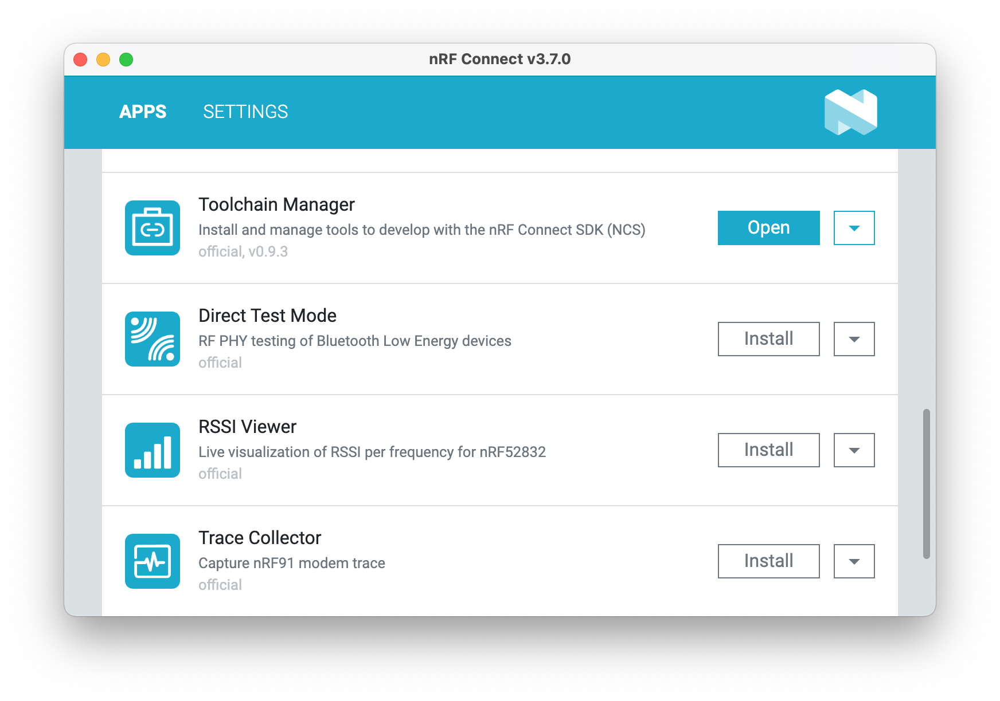
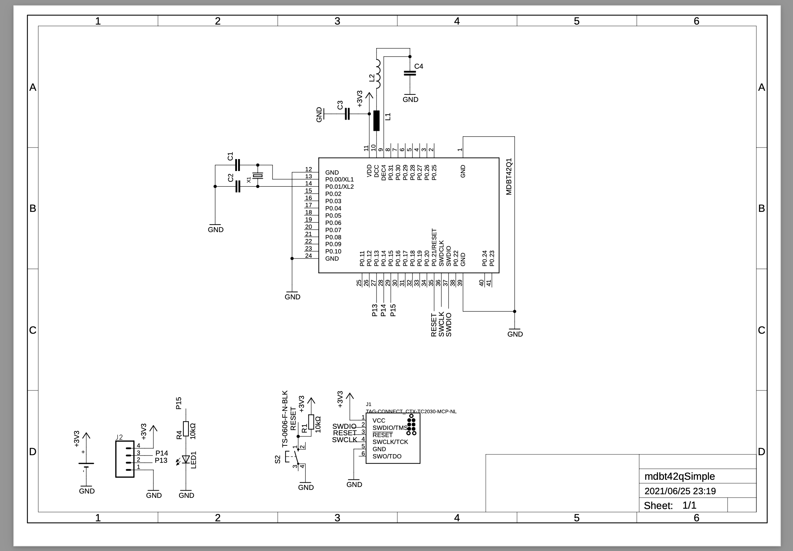
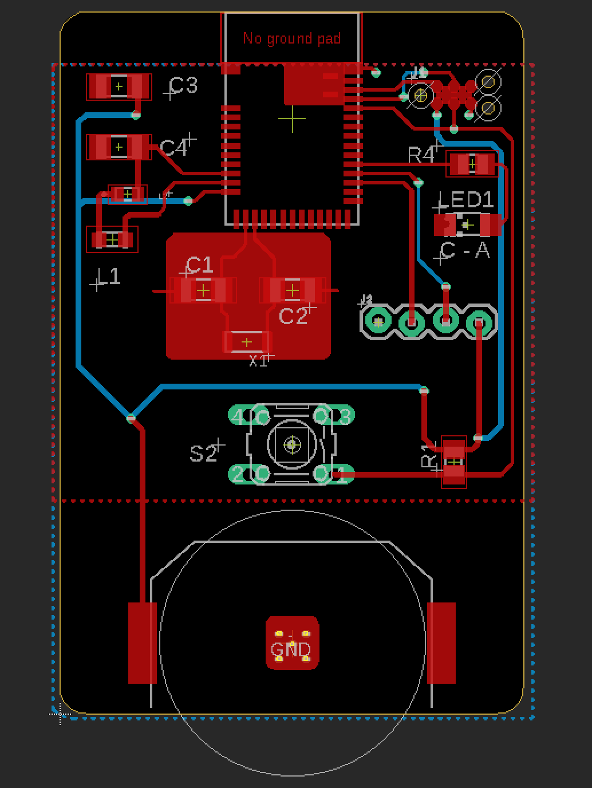
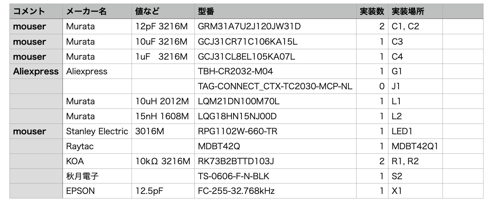
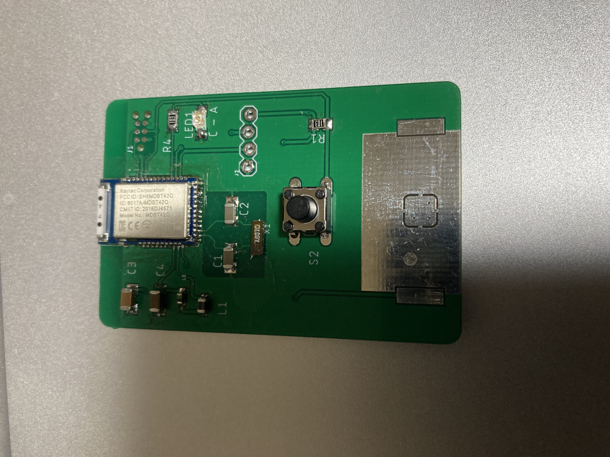

# Bluetooth 2023-05-09 01:30 までの備忘録

[TOC]


## Introduce

1. 『Mbedで出来るって言われてもねぇ？』ってゆわれた（煽られた？）ので、メーカーが提供しているSDKを扱えるようになる（ファームウェアとやらを書けるようになる）  
2. 『ES品は自身で担保出来ないとダメだぞ🌟』ってゆわれた（煽られた？）ので、基板設計が出来るようになる   
3.  ちょっと楽しくなってくる <- New !（ｲﾏｺｺ）  

## BLE4.0からの流れ

Bluetooth LE(以下BLEと表記)4.0 〜 4.2 まで  

### BLEの基礎

低消費電力  
間欠通信  
再接続性が高い  
GATTプロファイル  
Bluetooth3までとの互換性は無い  

BLE4.0 - BLE Peripheral  
BLE4.1 - BLE Peripheral / Central  
BLE4.2 - GATT MTU / ATT MTU Exchange / LE Secure Connection  

Bluetooth3 までのを含むモジュールの場合、Dual mode。BLEだけの場合はSingle modeとなる  

### ターゲット
スマフォ・タブレットと繋げるというのがBluetooth - BLEの役割  

### メモ
**Bluetooth3まではSPPとかだったけど、BLEの場合はGATTベース**  
**データ構造を任意に定義できるようになった**  
**基本的にはMAX 20byte(octet)まで送受信可能**  

**Peripheral Role でのアドバタイズのUUIDはビッグエンディアン（CentralからScanする際はPeripheralのadv UUIDを反転させてscanさせないとデバイスが見えない）**  

**GATTのRead / Notification / Indication それぞれどう振る舞う？**  
  - ReadはGATT Clientから読む。NotificationはGATT Serverから送る。IndicationはNotification + ACK。IndicationはACK返すだけ  

**Read時にサービスから読み込むGATT Characteristicの順番はどうなっている？**  
  - Characteristics を先にくっ付けた順番 (GattCharacteristic *ControllerChars[] = { &accelChar, &writeChar, };) で読まれる。Notificationの時も最初にくっ付けたcharacteristicが多く来る・・・のかな？)  

**BLEって、クラシックBluetoothのSPPみたいにシリアル通信できないの？**  
  - iOSをClientにして、dispatch_queue_t centralQueue = dispatch_queue_create("hoge.fuga", DISPATCH_QUEUE_SERIAL); としてSerialQueueにしてReadすれば出来る。  
  - Notification / Indicationでは出来ない -順不同になる-   
  - 特に、コンカレントな接続で複数デバイス接続するともう順番ぐちゃぐちゃになるます。  

**BLE4.2 で ATT MTU Exchange を使用することにより、247オクテットまでは拡張できるようになった。**  
  - ただしアプリケーションより下のレイヤーでパケットが分割（L2CAPだと・・・なんだろ？フレーム？）されて送信されたりするし、その辺りは物理層とSoftDeviceなどの下位レイヤーの実装に依る。  
  - あと、デバイスでMTUを247にしてもiOSとのMTU交換時にiOS側が決めるので、iOSのバージョンによっては185になったりします。  
  - そうなると結局中途半端なので、データ長は128など区切りのいいとこで区切るか、もしくはGATT Clientでデータはくっ付けるので、データ長が分かれば受信側の最大長のData Lengthで送信しておけばいいです  

**Readの時にGATT Characteristicの読み込み（複数Readしていると）処理が追いつかないよ！？**  

  - ReadするCharacteristicの数を減らすか、複数のPeripheralに分けましょう。  

**センサーが速すぎて、BLEのコネクションインターバル内に収まらない**  
  - 512Hzとかのセンサーをくっ付けると、コネクションインターバルの最小値7.5msで追いつけないので、配列や構造体に複数サンプル載せましょう。  

**開発中にGATTを変えると、iPhoneのBluetoothをオン・オフしないとダメだけど、service changedっていうCharacteristicもあるようです。**  
  - でもペアリングしていると、ペアリング情報を削除してBTをオン・オフしないとダメなので、微妙です。もう、BTオン・オフすれば良いんじゃないかな・・・。  

**ペアリングの情報がiPhoneに残っていると、BLEデバイスのHexファイルを書き換えた時、iPhoneのBluetoothをON/OFFしてもキャッシュが残ったままでハマる**  
  - ペアリング情報を削除後、iPhoneのBluetoothをON/OFFしましょう 

**パケット落ちって分かるの？**  
  - CRCは付いてるけど、エラー訂正はBluetooth5のCODEDを使うしか無い。  

**受信側ではちゃんとバッファリングしような。**  


**ペアリングとボンディングって違うの？？？（何が違うの？どう違うの？？？**
  - めっちゃ大雑把に。鍵交換をするのがペアリング。鍵を保存するのがボンディング（っていうらしいです）  
  - 両方を含めた意味で、ペアリングと呼ぶことが多いらしいです。  

**GAPとGATT**  

**GAP**  
  - 役割（Role）・デバイス名・コネクションインターバルなどBLEデバイス全体に関わるパラメータを設定します。  

**GATT**  

  - データの定義と振る舞いを任意に設定できます。  
  - Bluetooth SIGによってあらかじめ決められた16bit UUIDのプロファイルもあります。開発者が加速度センサーなどを繋いでスマートフォンなどにセンサー値を送信したりする時、任意のデータ構造とRead/Write/Notification/Indicationなどの振る舞いを設定できるのが GATTになります(128bit UUIDね)。  
  - Bluetoothも無線でネットワークだから、データは直列化（シリアライズ）して送信しましょう.  

**GATT Server / GATT Client**  
  - データを持っている方がサーバー。データを受け取る方がクライアント。  
  - BLEでは通常、（センサーの）データを持っているBLEデバイスがサーバーになる事が多い。  
  - L2CAPのレイヤーではマスター・スレーブと言ったりするらしいけど、レイヤーが違うと呼び方が違いますよ。という事だそうです。  


**Security Manager**  
  - BLEではペアリングは無い・・・という解説を見かけたりすることもありますが、スマートフォンとBLEデバイスを１対１で接続する場合にペアリング（及びボンディング）させる事もできます。  
  - その際に鍵の交換などの処理を司っているのがSecurity Managerになります。  
  - NFCを利用したOOBペアリングというのもあります。  

**ANCS(Apple Notification Center Service)**  
  - スマフォ(iPhone/iPad)・BLEデバイス連携でよくある、スマフォ(iPhone/iPad)の通知情報をBLEデバイスに伝える仕組み・・・ですが、これは少々特殊で、iPhoneとBLEデバイスが両方Peripheral Roleです。  
  - つまり、Roleとしては両方PeripheralですがGATT ServerとGATT Clientが逆になっている・・・ということです。  

## Bluetooth 5
2022年 7月時点での話のまとめ  

Nordic semiの場合、nRF51822 及び nRF52xxx  
SoftDevice駆動。工藤ちゃうで駆動やで。  

nRF51/52共、BLEの電波以外の電波も吹けます。ANT+ とか micro:bitみたいにRadio（無線）とか
nRF52840は 802.15.4 も対応  

大雑把にまとめると 

1M PHY / 2M PHY(192kbs / 256kbs) による（BLE4.2までと比べて）高速通信（１対１なら）  
Long Range  
アドバタイズメントパケットの拡張  

但し、これらは必須ではなくErrataに対応していればBluetooth5となる点に注意が必要  
Bluetooth SIG認証は 最低限Bluetooth 4.2に対応していないと取得出来ないように変更されました。  

### Bluetooth5 対応MCU 
**がれすたさんツッコミありがとうございます  

（Nordic Semiの場合。他社さんも色々あるけど、有りすぎるのとソフトウェアの方知らないんでとりあえずNordic限定で）  

nRF52832 - RAM  32 / 64KB 64MHz Cortex-M4F  
nRF52805  （しらない）  
nRF52810 - RAM       24KB 64MHz Cortex-M4 値段が nRF52832の半分くらい？ 廉価版  
nRF52811　(しらない)  
nRF52840 - RAM      256KB 64MHz Cortex-M4F  5.5V  
nRF52833 - ・・・ AoA / AoD Bluetooth5.2 対応  
nRF52820 - RAM 32KB / Bluetooth5.3 対応 (メチャ小さいから、これがイチオシ)  
nRF5340 - でゅあるこあのスゴイやつ！！   
nRF54H20 - 謎の H の秘密が明らかになるのはいつ？！ <- New  

まぁ、いいやめんどくさい、スペックシート見てくれ。  


だーーーーかーーーらーーーーーーー安いって理由でやるとソフトウェアが困るんだよーーーーーーーーーーー！！！！！  
メモリー足りねーんだよーーーーーばーかばーかばーかばーかばーかばーかばーかばーかばーか。って言うのも忘れずに  


### ハードウェア
あー、黙って nRF52 / nRF53 使ってください。  
全体のコストバランス見ようね。  

(Raytacのモジュール) Adafruit Feather nRF52 Bluefruit LE  
加賀FEIの開発用基板  
Nordic nRF52-DK  

この中でサクっと買えるのは Adafruit Feather nRF52 Bluefruit LE です  
仕事でやるなら 加賀FEI のボードだとピン配置がDKボード互換である場合が多いので、これかなぁ  

初心者は Adafruit Feather nRF52 Bluefruit LEかな  
Nordicの 52-DKボードは国内の電波法の技適が通っていないため、電波暗室などでなら使えますが通常の場所では電波法違反になるので使わないでください  

某秋月電子で販売されている AE-TYBLE16 は nRF51822 なので nRF5 SDKは 12 までしか対応しておりません。nRF51822はLEDを点灯させるために FETを別途繋がないと 0.5mA までしかドライブ出来ませんのでご注意ください。あとSWO・・・  

### nRF52840
USBも載りましたんで、もうnRF52840で行きましょう。そうしましょう。  

### nRF5340
デュアルコアになって更に省電力でパワーアップ！！もうこれにしましょう。  

### nRF52820
RAMが32KBですが、USB載ってて Bluetooth5.3対応なのでこれが良いです。これにしましょう。  
### nRF54H20
Cortex M33 + RISC-V + I3C + CAN もうこれで良いんじゃ無いかな。

### BLE over 6LoWPAN
 nRF5 SDK v17 からBLE 6LoWPANのサンプルが削除されました 


### Bluetooth5
データ長が決まったのを2Mbpsで高速に送るなら、低消費電力  
そうじゃないなら、クラシックと変わらない。らしい。（データ送信し終わったら、ちゃんとsleepしよう）  

なんだけど、結局 MCU内のハードウェア実装とStack内のソフトウェア実装に依存するんですよ・・・  
アプリケーションからは命令を叩くだけだから・・・  


Long Range  
電波損失の許容範囲が4倍になった  
低スループット  
電波の回り込み  
繋がりにくかったとこに繋がるように、がLong Rangeの目的  
Nordic測定で、室内で色々壁とかにぶち当たって80m くらいだって。  

Advertising Extensions  
アホやろ・・・（アドバタイズメント・パケットを255オクテットまで拡張出来るようになったので、6軸センサーのデータをブロードキャストのパケットに含む事が出来たりします。が、アドバタイズを20msで送信するならともかく、1sec固定でやったらセンシングにならんやろ・・・ってなります。あとプライバシー。パケット暗号化せず更にブロードキャストとか正気か？？？って話です）  

PHY  
1M PHY / 2M PHY / CODED PHY  


メッシュ  

Meshの前に  
Scatternet （スター型同士のトポロジ）  
拡張性は難しい  
信頼性もない  

Mesh  
信頼性  
自己回復、冗長性  
リレーなど  

nRF52840 でサポートするMesh  
ジグビー、すれっど、BLEのメッシュ  

Bluetooth Meshの種類  
Advertisingベアラー  
接続しない  
ブロードキャスト  

GATTベアラー  
ADVベアラーにスマフォを参加させるためにコンカレントな感じでGATTベース  

Bluetooth Mesh 結論  
今後に期待だよ  
コネクティッド型が出るまで我慢よ  


THREAD  
IPv6ベース  
100ms未満のレイテンシ  
ネットワークリーダーがダウンした時に自己判断して新リーダーを決定し、自己修復する機能付き  

THREADはParticleがやってたけど撤退した。  


Zigbee  
3.0 stack  
日本のアライアンス消えちゃった？  

コネクティビティなんとかっていのになってる。  

どっちが良いのか  
どっちもまだ低消費電力じゃないので人類には早すぎる！  

### 個人的補足的メモ 
要は、2.4GHzですよ。


### BT5.1の追加機能について;
• Angle of Arrival / Angle of Departure  
• Gatt caching  
• Advertising channel index  
• Periodic Advertising Sync Transfer  
• Sleeve of minor enhancements  

BT5.1 で Periodic Advertising Sync Transfer（定期的なアドバタイジングと同期した転送）機能が載りました。  
Gatt cachingもかなり有効に効いてます。  
BT5.2 で LE Audio が発表されました。  
nRF52のI2Sは24bitらしいです。nRF5340のI2Sは32bitらしいです。  


### Bluetooth SIG認証（最終製品登録）
取得しなければならない。  

Nordic semiの場合、MCUとSoftDeviceのバージョンそれぞれに応じてSIG認証を取っているので、選択するMCUとSoftDeviceのバージョンの組み合わせで申請する（んだと思う）  
nRF Connect SDK の場合は、ムセンコネクトさまが素晴らしい資料を公開されているので、そちらをご覧ください。  


## ソフトウェアの開発環境

### Arm Mbed
昔 MbedOS / オンラインコンパイラ/MbedStudioで開発出来たみたいです（Bluetooth StackはCordio Stackでした）  

### Arduino
  Adafruit Feather nRF52 Bluefruit LEもGitHubにそれぞれパッケージとして上がってますので、こちらをArduino IDEにインストールすればいいです。当然Nordicはサポートしてませんが。  

[ Adafruit Feather nRF52 Bluefruit LE ]  https://github.com/adafruit/Adafruit_nRF52_Arduino  


### nRF5 SDK
本命はこちら。Nordic semiのSDK。だいたいこのSDKをラップしてArduinoで使えるようにしてあったりするのですが、最新バージョンのSDKはNordicからリリースされるので、Arduinoでのライブラリはちゃんと更新されれば良いのですが、コミュニティの動きに寄るのでその辺りは不透明です  

IDEはKeil ARM-MDK / Segger Embedded Studio / IAR Embedded Workbench など Arm-cc / GCC-Toolchain  

### nRF Connect SDK
今やってる。なかなか良いよ。  

### ちょっと良いところ
どのソフトウェア環境で作成しても、ハードウェア構成が同じなら動きます。I2C / SPI / UARTのピン配置 は 固定ではなく、任意割り当てが基本的に可能なので  
まぁ、UARTがFTDIとかDAP Linkとかに繋がってたらダメだと思いますけど。  
逆に言うと、ピン割り当てが任意にできるので、GPIOで空いてるピンにI2CやSPIを割り当てたりできます。便利です  

### ハードウェア実装
LED1個（抵抗も忘れずに）、GPIOボタン1個、リセットボタン１個、32KHzクリスタル（水晶振動子）がモジュールに実装されてない場合はそれも付けといて。  

### ハードウェア(MCU)
1年ごとにスペックは倍になります！  

### ソフトウェア
もう全部 nRF Connect SDKでいいや。  


どうやら nRF Connect SDK v1.5.0 から nRF52 のサポートも入ったっぽい（ように見える）んですよね・・・  
nRF Connect SDK v1.9.0 から神のVSCode で開発できるからもう nRF Connect SDKでいいや。  

### iOS13とか
iPhone7 以降の端末はiOS13 (13.2？もうアップデートしちゃったからよく分かんない)でATT MTUが185を越えて200byte以上のパケットも扱えるように（iOSデバイス内のコンボチップとファームウェアに依存します）。  

nRF52が対向の場合、MTUは 247 - 3 = 244 まで扱えるので、そのくらいなら行けそう。とりあえず iPhone7（iOS13.2） <-> nRF52832 で 208byte パケットのやり取りが可能なことは確認。  
  
iOS13？！ もうすぐiOS17だから・・・（震え  


### 電池持ちとスループット

電池(電源周りの設計)はハードウェア設計に依存します。nRF52832の場合はコンデンサは C3 まで載せた方がいいけど、その辺は選択するMCU依存なので、各MCUのボード設計がモジュールメーカー（Nordicのパートナー企業様）から出ているので、そちらを参考にしてください（参考にしてくださいというか、そのまま回路図を起こしてください）  

あ、電池持ち書いてなかった.   
ZephyrOS™️ / nRF Connect SDK 使用時、BLEモジュールをDCDCモードで基板設計（配線）して、外付けDCDCの昇圧無し、1.7V まで駆動出来るようにした形で  

CR2032(220mAh) / muRata で 88時間程度（と思ったら、144時間くらい動きますやん）  
CR1632(140mAh) / muRata で 48時間程度 （Panasonicので 36時間程度）(いやこっちももっと動くはず) 

基板サイズは CR2032で 26mm くらい / CR1632 で 25mm くらいになると思うので、だいたいそんな感じ.  

となっています（自分調べ）  

スループットも10KB/secは出ます。最新のiPadで20KB/secくらいだったかなぁ・・・（ここうろ覚え 
次の nRF5340 はデュアルコアでネットワークコアがあるので更に省電力に！とても楽しみ！！  

### DCDC はちゃんと有効化しましょう
nRF Connect SDK では デフォルトでDCDCを使用するようにCONFIGの設定がされています。  
nRF5 SDK でも ble_stack_init() を呼んだ後に sd_power_dcdc_mode_set() しましょう。  
https://devzone.nordicsemi.com/f/nordic-q-a/35056/is-dc-dc-regulator-enabled-in-nrf52-series  

今までのセンサーは3V付近で動作するものが多かったですが、昨今のセンサーは 1.7V付近でも動作するものが多いので、MCUに搭載されているDCDCをきちんと使えばMCUもセンサーも1.7Vでもちゃんと動作させることが可能になりますので。  
  
CR2032 でも電池を振り絞れるように低めの電圧になった時にゴニョってしてくれるICを付けると良いよね。  


### スループットとかデータ長とか

スループットとかデータ長とかコネクションインターバルとかは クライアント側（ iOS ）が決めますが、その際どこまで出るかとかは iOS デバイス内のコンボチップの性能に依存していると思われるので、最新でリリースされている iOS デバイスとエントリーモデルでリリースされている iOS デバイスとでは発揮される性能に差が生じる可能性があります  

### サポート
技術サポートを受けたいのであれば、サポートを受けられるように選択をしましょう。  

### まぁ
なんでもかんでもBluetoothで良いかって言われたら、そんなわけは無いので（省電力でスマフォと繋げるなら１つの選択肢としてはあるだろうけど、別にWi-Fiでも良いし）なんかCellularもWi-FiもBluetoothもZigbeeもTHREADも全部できるモジュールを複数載せておけば安心なんだと思いますよ。


# Getting Started with nRF5 SDK on Nordic nRF52832

### Introduction
とてもツラたん  
製品を作る時は nRF5 SDKで担保します。  

### Installing the SDK  
Nordic semi. のWebサイトから SDKの Zipファイル nRF5_SDK_x.x.x_xxxxxxx.zip (for example, nRF5_SDK_v17.0.2_1a2b3c4.zip) と併せて使用するSoftDeviceをダウンロードします。  
SoftDeviceは利用する nRF52 MCUの種類とSoftDeviceが対応している機能によって S112, S113, S132, S140 などを適宜選択します。  

ダウンロードできたらzipファイルは任意の場所に展開します（スペースを含むフォルダに展開しない方がいいかも知れません）  

アプリケーション開発に使用できる IDE（統合開発環境）は Keil ARM MDK, IAR, Segger embedded studio(こちらは Nordic editionもあります) などがありますので、好きな IDE を選ぶことが可能です。  

printf みたいな標準出力マクロの NRF_LOG_INFO で頑張ります  
floatを出力する時はハマりますので頑張ってください  

```
NRF_LOG_INFO("  X: " NRF_LOG_FLOAT_MARKER "", NRF_LOG_FLOAT(event->data.quaternion.quat[0]));
```

### nRF5 SDK の BLE のサンプル
ble_app_uart とかのプロジェクトを丸ごとコピーして、それをベースに作ります。 BLEのService / Characteristicsも併せて設計し直します  

ble_app_uartとtwi_sensorの２つのサンプル・プロジェクトの内容を抑えておけば、大体は困らないハズ.  
困ったら DevZoneを検索してみましょう.  ちゃんとDCDC使おうぜ.

### ちゃんとこの nRF5 SDK をマスターしておきましょう
そうすると、nRF Connect SDK での開発が凄く楽になります。  

### DFU
UART とか BLE とか色々なやり方で DFU できるますが、Secure DFU なので DFU させるアプリケーションのhexに署名付けるんですよね。  
Arduino IDE の UARTのポート経由でファームウェアを流し込むような感じにはちょっと使えないので、そういうことがやりたい場合は Adafruit の Bootloader を使いましょう。  

# Getting Started with Zephyr RTOS on Nordic nRF52832

### Introduction

ん〜〜〜〜〜〜〜〜〜〜〜〜〜〜〜〜〜〜〜〜〜〜〜〜  


1. MbedOS <- なんもワカラン  
2. Arduino <- （わからない  
3. nRF5 SDK <- とてもツラい 

これからはZephyrだ！！！！  

ぜふぁーぜふぁー。  


### インストール
公式のドキュメント見れば1発。  
https://docs.zephyrproject.org/latest/  

インストールは既に終えているものとします。  
いちおう書きましょうか。  

```Install

/usr/bin/ruby -e "$(curl -fsSL https://raw.githubusercontent.com/Homebrew/install/master/install)"

brew install cmake ninja gperf ccache dfu-util qemu dtc python3

pip3 install --user west

wget gcc-arm-none-eabi-7-2018-q2-update-mac.tar.bz2のURL

tar jxf gcc-arm-none-eabi-7-2018-q2-update-mac.tar.bz2
sudo mv gcc-arm-none-eabi-7-2018-q2 /usr/local/gnuarmemb


cd ~
west init zephyrproject
cd zephyrproject
cd zephyr
git checkout v1.14.0
cd ..
west update

pip3 install -r ~/zephyrproject/zephyr/scripts/requirements.txt

/usr/local/gnuarmemb/bin/arm-none-eabi-gcc --version
arm-none-eabi-gcc (GNU Tools for Arm Embedded Processors 7-2018-q2-update) 7.3.1 20180622 (release) 

vi ~/.zshrc
set ZEPHYR_BASE=~/zephyrproject/zephyr
set ZEPHYR_TOOLCHAIN_VARIANT=gnuarmemb
set GNUARMEMB_TOOLCHAIN_PATH=/usr/local/gnuarmemb

cd ~/zephyrproject/zephyr
source zephyr-env.sh


cd samples/hello_world
west build -b nrf52_pca10040
west flash

```


### Hello world
cd \$ZEPHYR_BASE/samples/basic/blinky  
west build -b nrf52_pca10040  
west flash  

で Hex ファイルが書き込まれ、Lチカが実行されます。  
お疲れさまでした。  

### MPU6050
続いて、MPU6050を使用してI2Cですね。  

\$ cd \$ZEPHYR_BASE/samples/bluetooth  
\$ cp peripheral peripheral_mpu6050  

適当に peripheral とかをコピーしてください。それを改変します。  
コピーしたら、src/servicesディレクトリを作って、その中にble_mpu.hとble_mpu.cを作ります。  

MPU6050のライブラリは既にZephyrの中にありますので、興味があったら見てみてください。  

nRF52とMPU6050のI²Cのピンの接続は  

```i2c
&i2c0 {
	status = "ok";
	sda-pin = <26>;
	scl-pin = <27>;
};
```

とデフォルトで設定されているので、SDAが26, SCLを27に繋いでください。  


```CMakeLists.txt
cmake_minimum_required(VERSION 3.8.2)
include($ENV{ZEPHYR_BASE}/cmake/app/boilerplate.cmake NO_POLICY_SCOPE)
project(NONE)

target_sources(app PRIVATE
  src/main.c
  src/services/ble_mpu.c
)

zephyr_library_include_directories($ENV{ZEPHYR_BASE}/samples/bluetooth)
```


```prj.conf
# Incresed stack due to settings API usage
CONFIG_SYSTEM_WORKQUEUE_STACK_SIZE=2048
CONFIG_STDOUT_CONSOLE=y

CONFIG_BT=y
CONFIG_BT_DEBUG_LOG=y
CONFIG_BT_SMP=y
CONFIG_BT_SIGNING=y
CONFIG_BT_PERIPHERAL=y
CONFIG_BT_ATT_PREPARE_COUNT=2
CONFIG_BT_PRIVACY=y
CONFIG_BT_DEVICE_NAME="Zephyr Peripheral Sample Long Name"
CONFIG_BT_DEVICE_APPEARANCE=833
CONFIG_BT_DEVICE_NAME_DYNAMIC=y
CONFIG_BT_DEVICE_NAME_MAX=65

CONFIG_BT_SETTINGS=y

CONFIG_BT_RX_BUF_LEN=258
CONFIG_BT_GATT_CLIENT=y
CONFIG_BT_ATT_TX_MAX=10
CONFIG_BT_ATT_PREPARE_COUNT=2
CONFIG_BT_CONN_TX_MAX=10
CONFIG_BT_L2CAP_TX_BUF_COUNT=10
CONFIG_BT_L2CAP_TX_MTU=247
CONFIG_BT_L2CAP_DYNAMIC_CHANNEL=y
CONFIG_BT_CTLR_PHY=y
CONFIG_BT_CTLR_PHY_2M=y
CONFIG_BT_CTLR_RX_BUFFERS=2
CONFIG_BT_CTLR_TX_BUFFERS=10
CONFIG_BT_CTLR_TX_BUFFER_SIZE=251
CONFIG_BT_CTLR_DATA_LENGTH_MAX=251
CONFIG_BT_CTLR_ADVANCED_FEATURES=y


CONFIG_FLASH=y
CONFIG_FLASH_PAGE_LAYOUT=y
CONFIG_FLASH_MAP=y
CONFIG_FCB=y
CONFIG_SETTINGS=y
CONFIG_SETTINGS_FCB=y

##########
# for I2C 

CONFIG_I2C=y
CONFIG_I2C_NRFX=y
CONFIG_I2C_0_NRF_TWIM=y
CONFIG_I2C_INIT_PRIORITY=60
CONFIG_I2C_0=y
CONFIG_MPU6050_I2C_MASTER_DEV_NAME="I2C_0"

##############
# for MPU6050

CONFIG_SENSOR=y
CONFIG_MPU6050=y
```

~~~c
/* main.c - Application main entry point */

/*
 * Copyright (c) 2015-2016 Intel Corporation
 *
 * SPDX-License-Identifier: Apache-2.0
 */

#include <zephyr/types.h>
#include <stddef.h>
#include <string.h>
#include <errno.h>
#include <misc/printk.h>
#include <misc/byteorder.h>
#include <zephyr.h>

#include <settings/settings.h>

#include <bluetooth/bluetooth.h>
#include <bluetooth/conn.h>
#include <bluetooth/gatt.h>
#include <bluetooth/hci.h>
#include <bluetooth/uuid.h>

#include <sensor.h>
#include <gpio.h>

#include <stdio.h>
#include "services/ble_mpu.h"

// Buff
#define OUTPUT_BUF_SIZE sizeof(float)*6
static u8_t sensor_vals[OUTPUT_BUF_SIZE];


static int abs(int i) { return (i >= 0) ? i : -i; }

static inline double my_atof(const char* instr)
{
    double rtn;
    double base;
    
    for(rtn=0.0; *instr!='.'; instr++){
        if (*instr == '\0'){
            return rtn;
        }
        if (*instr >= '0' && *instr <='9'){
            rtn = rtn*10+(*instr-'0');
        }
    }
    instr++;
    
    for(base=0.1;*instr!='\0';instr++,base/=10.0){
        if (*instr >= '0' && *instr <='9'){
            rtn += base*(*instr-'0');
        }
    }
    
    return rtn;
}

static inline float out_ev(struct sensor_value *val)
{
    
    bool flag = false;
    if(val->val2<0 || val->val2<0){
        flag = true;
    }
    
    val->val1 = abs(val->val1);
    val->val2 = abs(val->val2);
    
    char buf[30];
    sprintf(buf, "%d.%06d", val->val1, val->val2);
    my_atof(buf);
    
    float ans = (float)my_atof(buf);
    
    if(flag == true){
        return (-ans);
    }
    
    return ans;
}

/* Custom Service Variables */
// sensor
static struct device* dev_mpu6050;

static struct bt_conn* p_conn = NULL;
static struct bt_gatt_exchange_params exchange_params;


//BLE Advertise
static volatile u8_t mfg_data[] = { 0x00, 0x00, 0xaa, 0xbb };

static const struct bt_data ad[] = {
    BT_DATA_BYTES(BT_DATA_FLAGS, (BT_LE_AD_GENERAL | BT_LE_AD_NO_BREDR)),
    BT_DATA(BT_DATA_MANUFACTURER_DATA, mfg_data, 4),
    
    BT_DATA_BYTES(BT_DATA_UUID128_ALL,
                  0xf0, 0xde, 0xbc, 0x9a, 0x78, 0x56, 0x34, 0x12,
                  0x78, 0x56, 0x34, 0x12, 0x78, 0x56, 0x34, 0x12),
};

static void exchange_func(struct bt_conn *conn, u8_t err,
                          struct bt_gatt_exchange_params *params)
{
    struct bt_conn_info info = {0};
    
    printk("MTU exchange %s\n", err == 0 ? "successful" : "failed");
    
    err = bt_conn_get_info(conn, &info);
    if (info.role == BT_CONN_ROLE_MASTER) {
        
    }
}

static void connected(struct bt_conn *conn, u8_t err)
{
    if (err) {
        printk("Connection failed (err %u)\n", err);
    } else {
        printk("Connected\n");
        p_conn = conn;
        
    }
}

static void disconnected(struct bt_conn *conn, u8_t reason)
{
    printk("Disconnected (reason %u)\n", reason);
    p_conn = NULL;
}

static struct bt_conn_cb conn_callbacks = {
    .connected = connected,
    .disconnected = disconnected,
};

static void bt_ready(int err)
{
    if (err) {
        printk("Bluetooth init failed (err %d)\n", err);
        return;
    }
        
    printk("Bluetooth initialized\n");
    
    //ble service init.
    bmpu_init();
    
    if (IS_ENABLED(CONFIG_SETTINGS)) {
        settings_load();
    }

    exchange_params.func = exchange_func;
    err = bt_gatt_exchange_mtu(NULL, &exchange_params);
    
    err = bt_le_adv_start(BT_LE_ADV_CONN_NAME, ad, ARRAY_SIZE(ad), NULL, 0);
    if (err) {
        printk("Advertising failed to start (err %d)\n", err);
        return;
    }
    
    printk("Advertising successfully started\n");
}

// Sensor data
void update_sensor_data()
{
    struct sensor_value sen_val[3];

    sensor_sample_fetch(dev_mpu6050);
    sensor_channel_get(dev_mpu6050, SENSOR_CHAN_ACCEL_XYZ, sen_val);
    
    float out_accel_x = out_ev(&sen_val[0]);
    float out_accel_y = out_ev(&sen_val[1]);
    float out_accel_z = out_ev(&sen_val[2]);
    
    printf("acc:   x: %.6f    y: %.6f    z: %.6f\n", out_accel_x, out_accel_y, out_accel_z);
    
    sensor_channel_get(dev_mpu6050, SENSOR_CHAN_GYRO_XYZ, sen_val);
    
    float out_gyro_x = out_ev(&sen_val[0]);
    float out_gyro_y = out_ev(&sen_val[1]);
    float out_gyro_z = out_ev(&sen_val[2]);
    
    printf("gyr:   x: %.6f    y: %.6f    z: %.6f\n", out_gyro_x, out_gyro_y, out_gyro_z);
    
    memset(sensor_vals, 0, sizeof(sensor_vals));
    
    memcpy(&sensor_vals[sizeof(float)*0], &out_accel_x, sizeof(float));
    memcpy(&sensor_vals[sizeof(float)*1], &out_accel_y, sizeof(float));
    memcpy(&sensor_vals[sizeof(float)*2], &out_accel_z, sizeof(float));
    memcpy(&sensor_vals[sizeof(float)*3], &out_gyro_x, sizeof(float));
    memcpy(&sensor_vals[sizeof(float)*4], &out_gyro_y, sizeof(float));
    memcpy(&sensor_vals[sizeof(float)*5], &out_gyro_z, sizeof(float));

}


void main(void)
{
    /* Set LED pin as output */
    struct device* port0 = device_get_binding("GPIO_0");
    gpio_pin_configure(port0, 17, GPIO_DIR_OUT);
    
    // flash  LED
    gpio_pin_write(port0, 17, 0);
    k_sleep(500);
    gpio_pin_write(port0, 17, 1);
    k_sleep(500);
    
    // sensor
    dev_mpu6050 = device_get_binding("MPU6050");
    printk("dev %p name %s\n", dev_mpu6050, dev_mpu6050->config->name);
    
    k_sleep(500);
    
    // set up BLE
    int err;
    err = bt_enable(bt_ready);
    if (err) {
        printk("Bluetooth init failed (err %d)\n", err);
        return;
    }
    
    bt_conn_cb_register(&conn_callbacks);
    
    while (1) {
        if(p_conn != NULL){
            if(bmpu_is_notify()){
                update_sensor_data();
                bmpu_notify(p_conn, sensor_vals, OUTPUT_BUF_SIZE);
            }
        }
        k_sleep(100);
    }

}
~~~

~~~c
// ble_mpu.h
/** @file
 *  @brief BAS Service sample
 */

/*
 * Copyright (c) 2016 Intel Corporation
 *
 * SPDX-License-Identifier: Apache-2.0
 */

#include <zephyr/types.h>
#include <stddef.h>
#include <string.h>
#include <errno.h>
#include <misc/printk.h>
#include <misc/byteorder.h>
#include <zephyr.h>

#include <bluetooth/bluetooth.h>
#include <bluetooth/hci.h>
#include <bluetooth/conn.h>
#include <bluetooth/uuid.h>
#include <bluetooth/gatt.h>

#ifdef __cplusplus
extern "C" {
#endif

void bmpu_init(void);
bool bmpu_is_notify(void);
void bmpu_notify(struct bt_conn* conn, u8_t *p_vals, u16_t len);

#ifdef __cplusplus
}
#endif
~~~

~~~c
// ble_mpu.c

/*
 * Copyright (c) 2015-2016 Intel Corporation
 *
 * SPDX-License-Identifier: Apache-2.0
 */

#include "ble_mpu.h"

/* Custom Service Variables */
static struct bt_uuid_128 mpu_service_uuid = BT_UUID_INIT_128(
                                                      0xf0, 0xde, 0xbc, 0x9a, 0x78, 0x56, 0x34, 0x12,
                                                      0x78, 0x56, 0x34, 0x12, 0x78, 0x56, 0x34, 0x12);


static const struct bt_uuid_128 mpu_char_uuid = BT_UUID_INIT_128(
                                                          0xf1, 0xde, 0xbc, 0x9a, 0x78, 0x56, 0x34, 0x13,
                                                          0x78, 0x56, 0x34, 0x12, 0x78, 0x56, 0x34, 0x13);

static struct bt_gatt_ccc_cfg mpu_ccc_cfg[BT_GATT_CCC_MAX];

static volatile u8_t notifyEnable;

#define BT_BUF sizeof(float)*6
static u8_t mpu_vals[BT_BUF];

static void mpu_ccc_cfg_changed(const struct bt_gatt_attr *attr, u16_t value)
{
    notifyEnable = (value == BT_GATT_CCC_NOTIFY) ? 1 : 0;
}

/* Vendor Primary Service Declaration */
static struct bt_gatt_attr attrs[] = {
    /* Vendor Primary Service Declaration */
    BT_GATT_PRIMARY_SERVICE(&mpu_service_uuid),
    
    BT_GATT_CHARACTERISTIC(&mpu_char_uuid.uuid,
                           BT_GATT_CHRC_NOTIFY,
                           BT_GATT_PERM_READ | BT_GATT_PERM_WRITE,
                           NULL, NULL, mpu_vals),
                           //read_ct, write_ct, mpu_vals),
    
    BT_GATT_CCC(mpu_ccc_cfg, mpu_ccc_cfg_changed),

};

static struct bt_gatt_service mpu_svc = BT_GATT_SERVICE(attrs);


void bmpu_init(void)
{
    bt_gatt_service_register(&mpu_svc);
}

bool bmpu_is_notify(void)
{
    return notifyEnable;
}

void bmpu_notify(struct bt_conn* conn, u8_t *p_vals, u16_t len)
{
    if(conn == NULL){
        return;
    }
    
    if(!notifyEnable){
        return;
    }
    
    if(len > BT_BUF){
        return;
    }
    
    memset(mpu_vals, 0, sizeof(mpu_vals));
    memcpy(mpu_vals, p_vals, BT_BUF);
    
    bt_gatt_notify(conn, &attrs[1], (u8_t *)mpu_vals, BT_BUF);
}
~~~

あとはLチカの時と同じように、west build / west flash 叩けば動きます。  

west build -b nrf52_pca10040  
west flash  

イゴイタ。  

やってみたら、めちゃくちゃ直感的でnRF5 SDKよりもはるかにコード量が少なくなります。
BLE / Blutooth部分に至っては、prj.conf に設定を書くだけ。exchangeのトコだけは一部関数を呼びますが。  

I²C などのセンサー周りさえしっかり押さえられればすごく楽チンぽんですよ。  

Zephyr RTOSは 2019/04 現在 v1.14 までリリースされていて、このバージョンでLTSにもなっています（そしてみんなダイスキ・オープンソース！）   

## Zephyr RTOS Programming ( I²C 編 )

書こうかどうしようか迷ったけど書いとこか。  
まぁ、ツラいよねっていうやつ。定番の。  

### Zephyr のセンサー周り

MPU6050のmain.c   

~~~c
/* main.c - Application main entry point */

/*
 * Copyright (c) 2015-2016 Intel Corporation
 *
 * SPDX-License-Identifier: Apache-2.0
 */

#include <zephyr/types.h>
#include <stddef.h>
#include <string.h>
#include <errno.h>
#include <misc/printk.h>
#include <misc/byteorder.h>
#include <zephyr.h>

#include <settings/settings.h>

#include <sensor.h>
#include <gpio.h>
#include <stdio.h>
#include <stdlib.h>

static inline float out_ev(struct sensor_value *val)
{
    
    bool flag = false;
    if(val->val2<0 || val->val2<0){
        flag = true;
    }
    
    val->val1 = abs(val->val1);
    val->val2 = abs(val->val2);
    
    char buf[30];
    sprintf(buf, "%d.%06d", val->val1, val->val2);
    
    float ans = (float)atof(buf);

    if(flag == true){
        return (-ans);
    }
    
    return ans;
}

//sensor
static struct device* dev_mpu6050;


// Sensor data
void update_sensor_data()
{
    struct sensor_value sen_val[3];

    sensor_sample_fetch(dev_mpu6050);
    sensor_channel_get(dev_mpu6050, SENSOR_CHAN_ACCEL_XYZ, sen_val);

    float out_accel_x = out_ev(&sen_val[0]);
    float out_accel_y = out_ev(&sen_val[1]);
    float out_accel_z = out_ev(&sen_val[2]);
    
    printf("acc:   x: %.6f    y: %.6f    z: %.6f\n", out_accel_x, out_accel_y, out_accel_z);
    
    sensor_channel_get(dev_mpu6050, SENSOR_CHAN_GYRO_XYZ, sen_val);
    
    float out_gyro_x = out_ev(&sen_val[0]);
    float out_gyro_y = out_ev(&sen_val[1]);
    float out_gyro_z = out_ev(&sen_val[2]);
    
    printf("gyr:   x: %.6f    y: %.6f    z: %.6f\n", out_gyro_x, out_gyro_y, out_gyro_z);
    
}


void main(void)
{
    // sensor
    dev_mpu6050 = device_get_binding("MPU6050");
    printk("dev %p name %s\n", dev_mpu6050, dev_mpu6050->config->name);
    
    k_sleep(500);
        
    while (1) {
        update_sensor_data();
        k_sleep(K_MSEC(1000));
    }
}
~~~

これ見た瞬間、アホか！！って思いますよね。  

Zephyrのセンサー関係のドライバは $ZEPHYR_BASE/drivers/sensor 以下に。サンプルはsamples/sensor以下にあるわけですが、大体が sensor.h を include してこんなようなコードを書くんだそうです。  

が、一応やり方は３つくらいあって、Sensor / Device Driver Model / I²C（直叩き？）になるんだそうです。しらんけど。  

### Sensor
要はね、最終的な結果はfloatで欲しい場合が多いんですよ。  
んで、sensorを使うと、sensor.hに  

```
struct sensor_value {
	/** Integer part of the value. */
	s32_t val1;
	/** Fractional part of the value (in one-millionth parts). */
	s32_t val2;
};
```

とかいう構造体になってて、加速度センサや温度センサの場合に仮数である整数部がval1に。小数部がval2に入ります。ちゃんとコメントに書いてありますね。読みましょうね。今読みました。  

変換しろって？？？？って思うじゃないですか。  

んで、s32_t ですよ。両方に符号付くじゃないですか。もうね。アホかと。  
だからout_ev関数みたいにアホな処理を自前で書かないといけないし、stdlibは必要最小限しか実装されてないからatof関数とか普通に呼ぶとコンパイルエラーになるし。  

だったら最初からfloatで値出せるように書くよ！！！書き方どこ！！！ってなりますよ。  

まだサンプルがあれば良いのですが、一から自分でドライバを書こうと思ったらこの書き方はちょっと無いかなって。最悪 * void が使えるのでね、でも * void なんて実務で書いたら、タヒね！！！ってマガオで言われるよきっと。  

sensor_channel_get の3番目の引数・・・（おっとこれ以上いけない  


### I²C 直叩き

これも無いかなって。  
$ZEPHYR_BASE/drivers/sensor 以下に収めるようにするのがZephyrでの作法・・・と見えますので。  
で、drivers/sensor 以下に配置した場合、センサーとmainの処理がそれぞれ別のスレッドで動くようです。  
起動した時にmainの処理よりも先にセンサーの処理が走って、その後mainが動きますね。  

### Device Driver Model
Device Driver Model ( device.h )を利用すると、過度なカプセル化や煩雑なコードにならなくて済みそうかなと。  

あと、MbedOSやArduinoやnRF5 SDKで書いたコードを利用しやすそうですし。  

$ZEPHYR_BASE/drivers/sensor 以下に書くのはSensorと同じ要領です。  

~~~c
//lsm9ds1.h
/*
 * Copyright (c) 2016 Intel Corporation
 *
 * SPDX-License-Identifier: Apache-2.0
 */

#ifndef ZEPHYR_DRIVERS_SENSOR_LSM9DS1_LSM9DS1_H_
#define ZEPHYR_DRIVERS_SENSOR_LSM9DS1_LSM9DS1_H_

#include <device.h>
#include <gpio.h>
#include <misc/util.h>
#include <zephyr/types.h>
#include <sensor.h>

typedef void (*lsm9ds1_sample_fetch_t)(struct device *device);
typedef void (*lsm9ds1_channel_get_t)(struct device *device, enum sensor_channel chan, float *val);

struct lsm9ds1_api {
    lsm9ds1_sample_fetch_t sample_fetch;
    lsm9ds1_channel_get_t  channel_get;
};

struct lsm9ds1_data {
    struct device *i2c;

    float accel_x;
    float accel_y;
    float accel_z;
    
    float gyro_x;
    float gyro_y;
    float gyro_z;
    
    float magn_x;
    float magn_y;
    float magn_z;
    
    float temperature_c;
};


#endif /* ZEPHYR_DRIVERS_SENSOR_LSM9DS1_LSM9DS1_H_ */

~~~

Sensorの時と違うのは  

typedef void (*lsm9ds1_sample_fetch_t)(struct device *device); の定義と  
struct lsm9ds1_api{}  の定義ですね。  

実装の.cコード  

~~~c
//lsm9ds1.c

・・・省略・・・

static void lsm9ds1_channel_get(struct device *dev,
                               enum sensor_channel chan,
                               float* fp_val){}
static void lsm9ds1_sample_fetch(struct device *dev){}

static const struct lsm9ds1_api lsm9ds1_driver_api = {
    .sample_fetch = lsm9ds1_sample_fetch,
    .channel_get = lsm9ds1_channel_get,
};

・・・中略・・・
DEVICE_AND_API_INIT(lsm9ds1, CONFIG_LSM9DS1_NAME, lsm9ds1_init, &lsm9ds1_driver,
                    NULL, POST_KERNEL, CONFIG_SENSOR_INIT_PRIORITY,
                    &lsm9ds1_driver_api);

~~~

samples/sensor/lsm9ds1  

```CMakeLists.txt
# SPDX-License-Identifier: Apache-2.0

cmake_minimum_required(VERSION 3.13.1)
include($ENV{ZEPHYR_BASE}/cmake/app/boilerplate.cmake NO_POLICY_SCOPE)
project(NONE)

FILE(GLOB app_sources src/*.c)
target_sources(app PRIVATE ${app_sources})

# 追加
zephyr_library_include_directories($ENV{ZEPHYR_BASE}/drivers/sensor/lsm9ds1)

```

~~~c
//main.c
/*
 * Copyright (c) 2012-2014 Wind River Systems, Inc.
 *
 * SPDX-License-Identifier: Apache-2.0
 */

#include <zephyr.h>
#include <device.h>
#include <sensor.h>
#include <stdio.h>

#include <lsm9ds1.h> // drivers/sensor/lsm9ds1

void main(void)
{
    struct device *dev = device_get_binding("LSM9DS1");

    if (dev == NULL) {
        printk("Could not get LSM9DS1 device\n");
        return;
    }

    printk("dev %p name %s\n", dev, dev->config->name);

    struct lsm9ds1_api* dev_api = (struct lsm9ds1_api *)dev->driver_api;
    
	while (1) {
        float accel[3], gyro[3], mag[3];
        float temp;
        
        dev_api->sample_fetch(dev);

        dev_api->channel_get(dev, SENSOR_CHAN_ACCEL_XYZ, accel);
        dev_api->channel_get(dev, SENSOR_CHAN_GYRO_XYZ,  gyro);
        dev_api->channel_get(dev, SENSOR_CHAN_MAGN_XYZ,  mag);
        dev_api->channel_get(dev, SENSOR_CHAN_DIE_TEMP,  &temp);
               
        printf("Accel: %.6f, %.6f, %.6f\n", accel[0], accel[1], accel[2]);
        printf("Gyro:  %.6f, %.6f, %.6f\n", gyro[0],  gyro[1],  gyro[2]);
        printf("Mag:   %.6f, %.6f, %.6f\n", mag[0],   mag[1],   mag[2]);
        printf("temp:  %.2f\n", temp);
        printf("\n");
        
        k_sleep(K_MSEC(1000));
	}
}

~~~

ドライバを完全にカプセル化出来てないジャマイカ！！！って怒られたらSensorベースにして、そっと * voidを手渡しましょう。  
その方が平和になると思います。こういう仕草は Simba RTOSとかをよく見て勉強をしましょう。  

## Zephyr RTOSのちょっとなところ(Reset pinのはなし)

GUIのIDEはSegger Embedded Studioというのがありますが、開発する時の公式チュートリアル見てると west build / west flash あるいは ninja build / ninja flash が書かれています。  

で、nRF52832でリセットピン出し忘れて、そのまま ninja flash !ってTerminalからhexを流し込むとリセット掛からなくて電源引っこ抜いてもブートして来ない・・・という事態に陥ったりします。泣きます。  

nRF5 SDKのnRFgo Studioだとリセットピン出してなくてもフツーに書き込めて、ブートもしてくるのでホントこの辺ね。この辺ね。もうね。  

＊nRF5 SDKでビルドしたHexはリセットピン出してなくても、ちゃんとブートします。
Zephyr RTOSでビルドしたHexだとブートしません。  


## 救世主 Segger Embedded Studio

開発環境のOSをmacOSにしてしまったので、WindowsでKeil使わなくなりました。  

Reset pinを出さずに ZephyrOSでやってると文鎮になることが分かったので、nRF5 SDK v15.3 と SES(Segger Embedded Studio)で開発していたのですが、なんと！ Download Hexした後に Verify すればリセットを掛けられる事が判明したのです！！！！すばらしい。さすが。もうさいこう。  

ZephyrOSのHexを焼いてすぐに文鎮になるわけではなく、電源を落として電源を入れ直した時にブートして来ないという現象なので、強制リセットをかけられればオッケーのようです。
そう。リセットさえかけれればブートするのです！  

なので、必ずSESでソフトウェア開発しながらIDEでHex(elf)をDownloadし、Verifyをかければリセットピン出してなくても大丈夫です。のハズ！！きっと！！  

## nRF Connect SDK v2.0 以降は 神の VSCode 
VS Codeに nRF Connect SDK の Extension が来ているので、神になりました。  
VS Code でも v1.9.x の古いバージョンの nRF Connect SDK も使用できるので神です。  

## それでもハマってしまったヒト向け

対象が nRF52832 / nRF52840 であるならですが、DAP Link書き込み器を用意してください。  
で、nRF5 SDKでビルドしたHexを何か用意します。Lチカでもいいです。  

それをDAP Link経由で書き込みます。１回 ZephyrOSのHexを書き込んだだけなら復活すると思います。  
２回以上 ZephyrOSで作ったHexを書き込んでるともう救えません。  

Thingy:91を色々書き込んでたら変な領域に書き込んだらしく、もうね。ははは。  


## どうしようも無くなったら

１人で鳴いてるDCDCの静かな鳴き声を聞きましょう。  

## なんとかする
[DTS / DeviceTree and SOC Definitions](https://docs.zephyrproject.org/latest/application/index.html#custom-board-devicetree-and-soc-definitions) にカスタムな設定をしておいて、board.c を追加すればイケるかなぁと。  

~~~c
//board.c
/*
 * Copyright (c) 2018 Nordic Semiconductor ASA.
 *
 * SPDX-License-Identifier: Apache-2.0
 */

#include <zephyr.h>
#include <init.h>
#include <gpio.h>

#define PIN 21

static void chip_reset(struct device *gpio,
               struct gpio_callback *cb, u32_t pins)
{
//    const u32_t stamp = k_cycle_get_32();

//    printk("GPIO reset line asserted, device reset.\n");
//    printk("Bye @ cycle32 %u\n", stamp);

    NVIC_SystemReset();
}

static void reset_pin_wait_low(struct device *port, u32_t pin)
{
    int err;
    u32_t val;

    /* Wait until the pin is pulled low */
    do {
        err = gpio_pin_read(port, pin, &val);
    } while (err == 0 && val != 0);
}

static int reset_pin_configure(struct device *p0)
{
    int err;
    u32_t pin;
    struct device *port = NULL;

    static struct gpio_callback gpio_ctx;

    /* MCU interface pins 0-2 */
    if (IS_ENABLED(CONFIG_BOARD_nRF52_CUSTOMBOARD_RESET_P0_21)) {
        port = p0;
        pin = PIN;
    }

    if (port == NULL) {
        return -EINVAL;
    }

    err = gpio_pin_configure(port, pin,
                 GPIO_DIR_IN | GPIO_INT | GPIO_PUD_PULL_DOWN |
                 GPIO_INT_ACTIVE_HIGH | GPIO_INT_EDGE);
    if (err) {
        //NVIC_SystemReset();
        return err;
    }

    gpio_init_callback(&gpio_ctx, chip_reset, BIT(pin));
    err = gpio_add_callback(port, &gpio_ctx);
    if (err) {
        return err;
    }

    err = gpio_pin_enable_callback(port, pin);
    if (err) {
        return err;
    }

    /* Wait until the pin is pulled low before continuing.
     * This lets the other side ensure that they are ready.
     */
//    LOG_INF("GPIO reset line enabled on pin %s.%02u, holding..", port == p0 ? "P0" : "P1", pin);

    reset_pin_wait_low(port, pin);

    return 0;
}

static int init(struct device *dev)
{
    int rc;
    int err;
    u32_t val = 0;
    struct device *p0;

    p0 = device_get_binding("GPIO_0");
    if (!p0) {
        return -EIO;
    }
    
    if (IS_ENABLED(CONFIG_BOARD_NRF52_CUSTOMBOARD_RESET)) {
        rc = reset_pin_configure(p0);
        if (rc) {
            return -EIO;
        }
        
    }

//    LOG_INF("Board configured.");

    return 0;
}


SYS_INIT(init, PRE_KERNEL_1, CONFIG_KERNEL_INIT_PRIORITY_DEFAULT);
~~~

SYS_INIT に NVIC_SystemReset(); を挟み込んで、リセットピンをreadしてみてリセットがかかるようにすれば起動してくると思いまする。  
こんな事するならリセットピン最初から出そうぜ。  
無条件に NVIC_SystemReset() すると永久にブートして来ないけどね。多分。  

## Bus Fault で苦しむ
リセットネタはここまでにして、次は I²C などのセンサー周りで起きるどうしようもない BUS FAULTです。  
これも CoolTermなどのコンソールをじーーーーっと眺めるしかないヤツですね。  
要は、mainスレッドとセンサーが起動するスレッドが別(drivers/sensorに入ってる奴らね)な為、mainスレッドから叩けばイケんじゃね？って思ってやってみるけど、センサーによってはmainスレッドから叩いても BUS FAULT を眺めることがしばしば。で、どうするか。  

とりあえず、I²C の初期化部分だけ init でやっといて、あとのレジスタ叩くトコからは mainスレッドからやっとけば、まぁ、良さそう・・・（だといいなぁ・・・トオイメをする）  

~~~c
//lsm9ds1.c

int lsm9ds1_init(struct device *dev)
{
    u32_t i2c_cfg = I2C_SPEED_SET(I2C_SPEED_STANDARD) | I2C_MODE_MASTER;
    struct lsm9ds1_data* drv_data = dev->driver_data;

    drv_data->i2c = device_get_binding(CONFIG_LSM9DS1_I2C_MASTER_DEV_NAME);


    if (drv_data->i2c == NULL) {
//        printf("Failed to get pointer to %s device\n", CONFIG_LSM9DS1_I2C_MASTER_DEV_NAME);
        return -EINVAL;
    }else{

        i2c_configure(drv_data->i2c, i2c_cfg);

    }

    return 0;
}
~~~

こんな感じにね。I²C だけ初期化しといて。あとは DeviceDriverModel で任意の関数をマッピングしておけば  

~~~c
// lsm9ds1.c
static const struct lsm9ds1_api lsm9ds1_driver_api = {
    .sample_fetch = lsm9ds1_sample_fetch,
    .channel_get = lsm9ds1_channel_get,
    .sensor_performance = lsm9ds1_sensor_performance,
    .initDone           = initDone,
};
~~~

もう好きに呼べますからね。  

これも起動時にBUS FAULTになったりならなかったりするし、（偉大なる）リセットボタン押せば確実にブートしてきたりするので、センサーが起動してないのにレジスタ叩きに行ってんじゃね？？とかアレコレ考えてみたりもするのですが、わかんないっスね。マルチスレッドね。もうね。  
テキトーに wait 挟んでからセンサーに接続した方が良いのかね。ワカンネ。  
センサー毎に調子を見つつコードを書きましょう。そうしましょう。  

[Isuue / https://github.com/zephyrproject-rtos/zephyr/issues/17689](https://github.com/zephyrproject-rtos/zephyr/issues/17689) にあったわ。  
センサー基板にLDOとか載ってたらもうautoだね。  

とまぁ、ここまで書いておいてなんですが、Python3 / pip3 などのOSS仕草によってSESでプロジェクトが上手い事開けないとかいうので、もう I2Cもmain と同じディレクトリにしとけば良いんじゃ無いかな.  

macOS Big Sur・・・ じゃないか、Xcode12.4 に含まれる macOS SDKのバージョンが新し過ぎて、SESでプロジェクト開くとエラーになるとかいうのを見てると、I2Cもmain と同じディレクトリにしとけば良いのかなって思います。  


## Zephyr RTOS の 真のmain()

zephyr/kernel/init.c ですね。  


こんなん分かるわけ無いやん？  
idleThreadとmainThreadとがあるらしく、extern void main()になっていて、そのすぐ下で main() を呼んでいますな。  
CMSIS RTOSなので、main も１つのThreadとして起動するわけですな。 しらんがな。  
CONFIG_MULTITHREADING=n とするとマルチスレッドを無効に出来るらしいけど、それやったらちゃんと動くかどうかZephyrのドキュメントにはしらんがなと書いてあって草も生えないわ。  

Sensorとかのデバイスはまた別スレッドとして device.c に \_\_device_init_start とか extern で定義されてて、それが linker-defs.h にあるから、この辺からboot時に別すれっどで起動するようになってんのかなぁ・・・わかんないなぁ・・・  

## RTC
Real Time Counterというらしい。  
nRF52 の Zephyr RTOS では CONFIG\_・・・なんだっけ？ NRF_RTC1 がデフォルトで有効になっている。  
NRF_RTC0 と NRF_RTC2 を使いたい場合はどうすれば良いのか分からない。しらない。(USE_RTC0 / USE_RTC2 とからしい？)  

k_cycle なんとか()を呼べばRTCのカウンター値を得られるらしい。  
k_uptime_getなんとかを呼べばタイムスタンプが得られるらしい。  
そんな感じらしい。  

## SysTick（割り込み）
某んんんっ！OS ではかなり悩まされたヤツですが、これはデフォルトではOFFになっていますのでご安心下さい。Cortex-M3 か M4 から乗ってるヤツですね。  

## Thread

こっちが動くコード。  


こっちが動かないコード。  


main() なんてただの飾りです（？）  

何故、main() を定義すると、K_THREAD_DEFINEで別途定義したスレッドが動いたり動かなかったりするのか。複数のスレッドを定義すると1つは動くのに2つ目からは動かなかったりするのか。  
mainスレッドを定義せず、K_THREAD_DEFINE で定義したスレッドだけを羅列した場合は全てのスレッドが問題なく動くのか・・・・という問題です。  


## 要因
kernel / init.c に定義されている main() 関数が weak で修飾されている（アプリケーションコード内で main() として宣言（？）出来るように \_\_weak で修飾されている）点がまず１点目。  

更に、init.c 内にて bg_thread_main() が真のmainスレッドであることが書かれており、その中で extern void main となっているのが２点目。  

\_\_weak 修飾子に関しては
[ARM Infomation Center](http://infocenter.arm.com/help/index.jsp?topic=/com.arm.doc.dui0348bj/CHDHHIGB.html) (http://infocenter.arm.com/help/index.jsp?topic=/com.arm.doc.dui0348bj/CHDHHIGB.html)にも ちゃんと！しっかり！書かれています。  


## 原因
mainスレッドの優先度が高すぎる。  

実際にmainスレッドが起動してくるのは、bg_thread_main() よりもっと前の関数で、prepare_multithreading() になりますが、この中にある z_setup_new_thread 関数で mainスレッドが生成されています。  
その際に指定されているプライオリティ（スレッドの優先度）が CONFIG_MAIN_THREAD_PRIORITY という定数で、これが kernel/Kconfig ファイル内で定義されています。その値が default 0 となっており、優先度の低いスレッドの処理が動かない・また k_delayed_work_init でスレッドを生成していると優先度の設定すら出来なくて、何をどうしたらいいのか分からなくなって詰みます。  

## 対応策

main スレッドの優先度を下げる。  

prj.conf に  

```prj.conf
# Main Thread Config
CONFIG_MAIN_THREAD_PRIORITY=7
```

と設定すると main() スレッドのプライオリティをデフォルトの 0 から 7 に出来る
ので、main() スレッドの優先度を下げれば良いっぽい。  

それだけだとまだダメなので、main以外の任意に走らせたいスレッドのプライオリティをmainスレッドよりもちょっと高く設定してやる必要があります（mainのプライオリティを７に設定したら、Lチカやるだけのスレッドはmainより高い６とか５とかにしておいて下さい）。  

```main.c
/* scheduling priority used by each thread */
#define PRIORITY 6
```
こうね。  

## Ubuntu の場合

ファームウェアのビルドと書き込みにはwestを使う。  

\$ cd ./zephyrproject/zephyr/samples/bluetooth/  
\$ cd peripheral_hoge/  
\$ west build -b nrf52_pca10040 .  
\$ west flash -d build  

Armのボードだけを使用する場合は、gcc-arm-none-eabi-6-2017-q2-update-linux.tar.bz2 をダウンロードすればおk。  

```~/.bashrc
export ZEPHYR_BASE=/home/user/zephyrproject/zephyr
export ZEPHYR_TOOLCHAIN_VARIANT=gnuarmemb
export GNUARMEMB_TOOLCHAIN_PATH=/usr/local/gnuarmbemb
#export ZEPHYR_TOOLCHAIN_VARIANT=zephyr
#export ZEPHYR_SDK_INSTALL_DIR=$HOME/zephyr-sdk-0.10.3
```

zephyr-sdk.run とかいうアーカイブはArm（もうArmなのかarmなのかARMなのか分かんなくなってるけどゴメンね）を含む他のToolChainも入っているので、RISC-Vやる時とかは環境変数をgnuarmembではなくzephyrにしてやる必要がある。  

cmake でのプロジェクトの展開はできるけど、Ubuntuでninja flash するとJ-linkのドライバ内で最後の最後にHaltするので上手くファームウェアが焼けないようです。westコマンド使ったって。  

とりあえず、Ubuntuでのセットアップは３日くらいハマればまぁ、動くと思います。ハマって下さい。19.10の方が良いかもしんない。  

### ZephyrOSの省電力のひみつ
OSS である ZephyrOS に Nordicががんばってコミットしていますが、OSSであるおかげか Bluetoothスタック部分にもちゃんと改修が入ってて、RTCとPPI を使用した形でスタックがリニューアルされているため、CPUを使用しない（？）感じになっているようで、省電力がパワーアップしています。すごく延びます。  

省電力に動かしたいのであれば、Timer割り込みは積極的に使用するべきではありません。  
タイマー割り込みごとに LED をチカチカさせるなどの処理を行ってしまうと、n秒ごと（ Timerの周期ごと ）にCPUが起きるので、その分電池を消耗します。

Lチカをやるのであれば、BLEの周期ごとにLEDをtoggleさせた方が電池持ちが良くなります。  

ZephyrOSからはBLEの処理はPPIで走るので、実質センサーから値を読むのとLEDをチカチカさせる・・・くらいのタスクで済むと思われるので、無闇矢鱈に Timer割り込みするのは良くないです。  

気をつけてコードを書けば、CR2032 で 100時間連続稼働します。 <- New!  
追記： リチウムイオン電池版を作ったら、110mAh (CR2032の半分)で 99.5時間連続稼働したので、すごくなりました. <- New！！  


### おすすめの書籍
そんな私の手に差し伸べられた救世主！神！！友利奈緒が書いた nRF5 Segger Embedded Studio本がなんとboothに！！！！これは買わなくては！！！！  

[ゼロから作るBLEデバイス　nRFマイコンとSEGGER Embedded Studioでやってみた！](https://booth.pm/en/items/1577270)  

きっと多分おそらく！！ぜふぁーのも色々なことが書かれているんだ！！きっと！！！そうに違いない！！！！  

## と、ここまで書きましたが

ZephyrOS™️ はあくまでもLinux FoundationのオープンソースなProjectで、Nordic semi はOSSにコミットしつつ、その成果を nRF Connect SDK として ZephyrOS™️ を含む形で現在開発を進めています  
それはとてもアグリーですね  

Nordicの次期 SDK である nRF Connect SDKは ZephyrOS™️ がベースなので、Zephyrをちゃんと勉強しておきましょう。NCSはZephyr版を使うか、SoftDeviceController版を使うか選択しますね。  

それはとてもアグリーです  

### さて・・・

HAL の話ね。 I2C  にしろ、SPI にしろ、Zephyr RTOS / nRF Connect SDK では大体 HAL のお世話になると思うのですが、これが顕著に遅いため、nRF5 SDK と比較して 1〜2ms 時間がかかります。遅いです。  
これが結構致命的なので、nrfx ドライバが まぁ、本体なので、がんばって書いた方が幸せになります。  
特に ADC 周りでいい感じにやろうとすると、PPI + Easy DMA + nrfx ドライバで IRQ 割り込みハンドラ + Timer + BLE とかなるので、がんばりましょう。頑張ると 200Ksps できます。  

nRF Connect SDK は nRF5 SDK + おまじないが必要になるので、まぁ、頑張るしかないかなぁ・・・と思います。  

### では

えー、 RTOS だからといって、nRF52系では無闇矢鱈にスレッド（Thread）でタスクを振り分けたりしない方が良さそうです。いちいちキューに入れて、それを give / take でそれぞれ待って渡してなどとタスクを区切りながらデータを渡すのであれば、素直にシーケンシャルに処理した方がタスクスイッチのコストが省けるため、正直いって nRF5 SDK と変わりなく、上から順番に処理した方が無駄が無いと思われます。nRF52 MCU はシングルコアですし、nRF53 はアプリケーションコア＋ネットワークコアですからね。  

### と言ったところで

Nordic の SDK 内のサンプルはとてもとても有能ですが、Github(Nordic Playground) にアップロードされている サンプルコードがこれまたとてもいい感じに仕上がっているので、こういったいい感じに仕上がっているサンプルコードをぜひ参考にしましょう。  

### あ、sleep はしちゃダメですよ

nRF5 SDK (SoftDevice) の BLE 通信 ではもろに CPU がBLE 通信の処理を担っていたため、かなり電力を食いました。が、しかし、nRF Connect SDK からは PPI で CPU を介さずに BLE の通信処理を行うように BLE Stack が変わったため、 非常に省電力になっています。  

それに伴って、アプリケーションコードも変更する必要が出てきます。  

今までは、BLE 通信が終わったら即 CPU を Sleep させて再度起こしてから通信開始とか、あるいは何某かのトリガーを引いたら BLE 通信を行うという設計であれば、省電力になる・・・というスタイルが多かったように見えますが、nRF Connect SDK からは CPU を介さずにBLE 通信が行われるため、CPU を Sleep させない方が省電力になります。  

何が言いたいかというと、 CPU を sleep させた後に wake up した際の電池の消耗がBLE 通信よりも激しい為、CPU を sleep するよりも BLE 通信をし続けた方が遥かに電池消耗のコストが低く抑えれるという事です。  

下手に 数秒ごとに LED をチカチカさせる処理なんかを書いてしまうと、sleep からの復帰のための wakeup にかかる電力を余計に消耗してしまう羽目になるので、非常に良くないです。  


### （コイン）電池

コンビニエンスストア等の販売店へ行くと、色々なメーカー様の電池が販売されていますが、電池はメーカーごとにかなり違いが出ますので、注意して選ぶ必要があります。気をつけましょう。  

### 2021 / 08 / 25改訂 インストール＆セットアップ ( nRF Connect SDK 編 )

nRF Connect Desktop アプリケーションが進化し、3.7.0 以降は GUI で nRF Connect SDK や IDE である、Segger embedded Studio のインストールが可能になりました。  
なんと！ Install ボタンをクリックするだけで全てが完了してしまいます！！！  




### PPI vs EasyDMA

まぁ、両方使えるなら使えば CPU レスで駆動できるので良いのですが、PPI は イベント -> タスクを結ぶためのものなので、ちょっと難しい。ので、無理に使用しなくても良いかなと。  
どうしても Timer で μ秒 ごとに動かしたいとかある場合は容赦なく PPI のお世話になりますけども。  
ただ単に I2C 経由でセンサーの値を読みたいとかだったら PPI までは必要ないかなぁ。  

追記： PPI はいいぞ！！！  

# Getting Started with HardWare on Nordic nRF52832


### introduce

どうしてこうなった・・・  

### CAD
好きなのを選びます。KiCAD / EAGLE / ｱﾙﾃｨｳﾑ（高い） MCUのライブラリがあれば出来ます  

### 回路図


### アートワーク


こんな感じ。２層で出来ます。  

回路図さえキチンと出来てしまえば、あとのアートワーク設計では自動配線のボタン押すだけなので、とても簡単です。  

基板の製作は Seeed（eは３つ）のFusionPCBとかにお願いすると良いです。  
基板実装サービスも展開されていますので、もうそれはとても安心です。  

きちんとモジュールメーカーが提供している資料をよく見て回路を引きましょう。それをやるだけです。  

### 注意する点
  - CR2032が乗るサイズで横幅は 30mm が良いです.　縦幅は45mm くらい？この辺りもリファレンスに書いてあります（モジュールからどれだけ距離を空けろとかそういう）. ご安全に.  
  - 表面実装部品の手はんだは初心者には無理.  
  - BLE基板などのCAD入門の時とかは、プルアップ抵抗とかよく理解出来てないので、レクチャーしてくれる人が傍に居てもらえるといいです.  
  - 基板（アートワーク）はある程度大きめのサイズに出来るなら、大きめの部品を実装できるのでおススメ.  
  - BLEモジュールは小さいのを選択してもあまり基板サイズには影響しないので、標準サイズのモジュールで行きましょう（BLEモジュールよりも電池ホルダーのサイズが大きいのと、標準サイズのモジュールであれば、水晶振動子辺りを既にモジュール内で担保してくれているので安心です）.  
  - 結局基板の大きさを詰めても、22mm幅 とか多分そのくらい・・・くらいまではゆったりアートワーク引けますので、標準モジュールで良いですよ（小さくすればするほど必要な部品を実装出来なくなる危険性が高まりますし無線の出力も担保出来なくなるので、まぁそういうのは性能面の観点からはおススメしませんが）.  
  - 標準モジュールで、CR2032 なら 26.5mm幅。CR1632 で 25mm幅に収まります.  

### 基板の厚さに注意
1mm くらいは厚みがあった方が良いと思います.  
薄過ぎると 2.4GHz で飛ぶハズの電波が 2.4GHz から外れてしまうので、なるべく基板は厚めにしましょう.  
なのでフレキシブル基板は論外ですね.  

### 電池
まぁ電池まで担保できるなら好きにして良いと思うけど、PSEとか電池の劣化とか取引先とか、目に見えないコストまで担保できるなら色々選択は出来るだろうけど、ね.  

### なので


WLSCP パッケージ版のモジュールを使用すると、センサーもつけて 裏側に JST PHR-2コネクタつけて 18mm x 20mm くらいの基板サイズに実装可能です。  

### あぁ
そもそも リセットピンは出すだけじゃなくて、ちゃんとプルアップ抵抗付けておかないと不定になるから電源引っこ抜いてもそりゃブートせんわな。そりゃそうだよね。っていうことにちゃんと気がつけるようになります。
他の GPIO ピンに対しても同様ですよね。適宜プルアップもしくはプルダウン抵抗をちゃんと付けましょう。 10kΩ ね。  

### プルアップ抵抗は
10kΩ以上を載せましょう。3kΩとか低いのはダメですよ。引っ張られるよ。  

### nRF52のドライブ能力は
5mA （ nRF51822 の 0.5mA から１０倍に引き上げられました）なので、大体のケースは大丈夫かと思いますが、必要に応じてMOSFET も実装しておくと助かるかも知れません（こんな事もあろうかと！！的に）。  


### まずは手のせ出来るBLEモジュールでやってみよう


[ 回路図 ]  



[ アートワーク ]  



 [ BOM（部品一覧） ]   
はんだごてで付けられるよう、なるべく大きいサイズにしました 
  

ハンダ付けして完成  
  

でもやっぱりリフローの方がいいな。  
なんだっけ？ホットエアーでやるやつで炙れば良いかな。アレの方が簡単そう。  
  
### DFU するくらいなら DAPLink書き込み器をですね
UART  over DFU とか BLE over DFU とかありますけど、昨今はセキュリティの関係で気軽にさせてくれないんですよね。SecureDFUとか言って。だったら簡単に書き込み出来るDAPLink 書き込み器作っちゃった方がみんな幸せになりますよ。  


# Getting Started with CoreBluetooth on iOS

  

なんと iPad mini5とかをUSB接続して、Xcode でスループット測定とパケットキャプチャが同時にできちゃいます。画期的ですね。  

## CoreBluetooth


接続状態を管理する Manager クラス  

~~~swift
// BT_Manager.swift
//
//  BTManager.swift
//
//
//  Created by hoehoe on 2018/06/10.
//  Copyright © 2017年 chocbanana. All rights reserved.
//

import CoreBluetooth


@objc protocol BT_ManagerDelegate {

    func foundPeripheralDelegate(btPeripheral: BT_Peripheral)
    func lostPeripheralDelegate()
}

class BTManager: NSObject, CBCentralManagerDelegate, CBPeripheralDelegate
{
    
    static let shared:BTManager = BTManager()

    let serviceUUIDs:Array<CBUUID>? = [ CBUUID.init(string: "B5570001-8D38-4C97-972A-5AD5E9EAA182"), ]
    
    var manager:CBCentralManager! = nil
    var btPeripheral:BT_Peripheral! = nil

    weak var delegate:BT_ManagerDelegate?
    
    private override init() {
        super.init()
        manager = CBCentralManager(delegate: self, queue: nil)
    }
    
    func connect(peripheral :CBPeripheral){
         btPeripheral = BT_Peripheral()
         btPeripheral.peripheral = peripheral
         btPeripheral.setup()
        
         manager.connect(peripheral, options: nil)
         manager.stopScan()

     }
    
    func centralManagerDidUpdateState(_ central: CBCentralManager) {
        switch  central.state {
        case .poweredOn:
            start()
            break
        case .poweredOff:
            stop()
            break
        case .unauthorized:
            break
        default:
            break
        }
    }
    
    private func start(){
 
        manager.scanForPeripherals(withServices: serviceUUIDs, options: nil) //[advUUID]
        print("start scan")
    }
    
    private func stop(){
        
        if manager.isScanning == true {
            manager.stopScan()
        }

    }
    
    
    func centralManager(_ central: CBCentralManager, didFailToConnect peripheral: CBPeripheral, error: Error?) {
        self.delegate?.lostPeripheralDelegate()
    }
    
    func centralManager(_ central: CBCentralManager, didConnect peripheral: CBPeripheral) {
        print("didConnect")

        self.btPeripheral.peripheral.discoverServices(serviceUUIDs)
        self.delegate?.foundPeripheralDelegate(btPeripheral: self.btPeripheral)
    }
    
    func centralManager(_ central: CBCentralManager, didDisconnectPeripheral peripheral: CBPeripheral, error: Error?) {

        start()

    }
    
    func centralManager(_ central: CBCentralManager, didDiscover peripheral: CBPeripheral, advertisementData: [String : Any], rssi RSSI: NSNumber) {

        btPeripheral = BT_Peripheral()
        btPeripheral.peripheral = peripheral
        btPeripheral.setup()
        
        //print(advertisementData)
        
        self.manager.connect(peripheral, options: nil)
        
        print("didDiscover")
    
    }

}
~~~

データのやりとりを管理する Peripheralのクラス  

~~~swift
// BT_Peripheral.swift
//
//  BT_NegiPeripheral.swift
//  BT_NegiPeripheral
//
//  Created by hoehoe on 2018/06/10.
//  Copyright © 2018年 chocbanana. All rights reserved.
//

import CoreBluetooth


@objc protocol BT_PeripheralDelegate {
    func peripheral_Data( value:NSData )->Void
}

class BT_Peripheral: NSObject, CBPeripheralDelegate {
    var peripheral:CBPeripheral! = nil
        
    let notifyCharacteristicUUID:Array<CBUUID>! =
          [ CBUUID(string: "B5570002-8D38-4C97-972A-5AD5E9EAA182"), ]
    
    weak var delegate:BT_PeripheralDelegate?
    
    func setup()->Void{
        self.peripheral.delegate = self
    }
    
    func peripheral(_ peripheral: CBPeripheral, 
                         didDiscoverServices error: Error?) {
    
        for service:CBService in peripheral.services! {
            
            peripheral.discoverCharacteristics(notifyCharacteristicUUID,
                                                  for: service)
            print("service found")
        }
    }
    
    func peripheral(_ peripheral: CBPeripheral, 
              didDiscoverCharacteristicsFor service: CBService, error: Error?) {
              
        for characteristic:CBCharacteristic in service.characteristics! {
            //print(characteristic.uuid)
            for uuid in notifyCharacteristicUUID {
                if characteristic.uuid.uuidString == uuid.uuidString{
                    print("characteristic found")
                    peripheral.setNotifyValue(true, for: characteristic)
                }
            }
        }
    }
    
    func peripheral(_ peripheral: CBPeripheral, didUpdateNotificationStateFor characteristic: CBCharacteristic, error: Error?) {

    }
    
    func peripheral(_ peripheral: CBPeripheral, didUpdateValueFor characteristic: CBCharacteristic, error: Error?) {
        
        for uuid in notifyCharacteristicUUID {
            if characteristic.uuid.uuidString == uuid.uuidString {
                
                let data:NSData = characteristic.value! as NSData

                if characteristic.uuid.uuidString == "B5570002-8D38-4C97-972A-5AD5E9EAA182" {
                    print("hoge")
                    delegate?.peripheral_Data(value: data)    
                }else{
                    print("fuga")
                }
            }
        }
    }
    
    func notifyDisable(_ peripheral: CBPeripheral){
        for service:CBService in peripheral.services! {
            for characteristic in service.characteristics! {
                for uuid in notifyCharacteristicUUID {
                    if characteristic.uuid.uuidString == uuid.uuidString {
                        peripheral.setNotifyValue(false, for: characteristic)
                    }
                }
            }
        }
    }
    
}
~~~

こんな感じ。CoreBluetoothの資料はWebにたくさんあるので、そう困らないですね。Appleのドキュメントも充実してますし  
特に iOSアプリプログラマーなら困らないハズ・・・・・・・・・  
iOSアプリを入門するなら、動画でレクチャーしてもらえる ドットインストールとかおススメです.  


# Getting Started with NCS on nRF5340

新しくなった MCU です。 Cortex M33 です。  
WLCSP パッケージもありますので、超小型で設計が可能になってます。  

[ prj.conf (nRF5340-DK) ]
```prj_nrf53.conf
#
# Copyright (c) 2018 Nordic Semiconductor
#
# SPDX-License-Identifier: LicenseRef-BSD-5-Clause-Nordic
#

CONFIG_GPIO=y
# CONFIG_HEAP_MEM_POOL_SIZE=2048
CONFIG_NEWLIB_LIBC=y
CONFIG_STDOUT_CONSOLE=n
# CONFIG_NEWLIB_LIBC_FLOAT_PRINTF=y
# CONFIG_MAIN_STACK_SIZE=4096

# This example requires more workqueue stack
# CONFIG_SYSTEM_WORKQUEUE_STACK_SIZE=2048

# Main Thread Config
CONFIG_MAIN_THREAD_PRIORITY=7
#CONFIG_SIZE_OPTIMIZATIONS=y


# BT
CONFIG_BT=y

CONFIG_BT_SETTINGS=y
CONFIG_FLASH=y
CONFIG_FLASH_PAGE_LAYOUT=y
CONFIG_FLASH_MAP=y
CONFIG_NVS=y
CONFIG_SETTINGS=y

CONFIG_BT_DEBUG_LOG=n
CONFIG_BT_SMP=y
CONFIG_BT_SIGNING=y
CONFIG_BT_PERIPHERAL=y
#CONFIG_BT_GATT_DIS=n

#CONFIG_BT_GAP_PERIPHERAL_PREF_PARAMS=y
#CONFIG_BT_PERIPHERAL_PREF_MIN_INT=25
#CONFIG_BT_PERIPHERAL_PREF_MAX_INT=75
#CONFIG_BT_PERIPHERAL_PREF_SLAVE_LATENCY=4
#CONFIG_BT_PERIPHERAL_PREF_TIMEOUT=400

CONFIG_BT_ATT_PREPARE_COUNT=2
CONFIG_BT_PRIVACY=y
CONFIG_BT_DEVICE_NAME="nRF5x_yyy_zzz"
CONFIG_BT_DEVICE_APPEARANCE=833
CONFIG_BT_DEVICE_NAME_DYNAMIC=y
CONFIG_BT_DEVICE_NAME_MAX=65

CONFIG_BT_GATT_CACHING=y
CONFIG_BT_GATT_DYNAMIC_DB=y

# BLE DLE
CONFIG_BT_RX_BUF_LEN=258
CONFIG_BT_ATT_TX_MAX=10
CONFIG_BT_ATT_PREPARE_COUNT=2
CONFIG_BT_CONN_TX_MAX=10

CONFIG_BT_L2CAP_TX_BUF_COUNT=10
CONFIG_BT_L2CAP_TX_MTU=247
CONFIG_BT_L2CAP_DYNAMIC_CHANNEL=y

CONFIG_BT_CTLR_RX_BUFFERS=2
CONFIG_BT_CTLR_TX_BUFFERS=10
CONFIG_BT_CTLR_TX_BUFFER_SIZE=251
CONFIG_BT_CTLR_DATA_LENGTH_MAX=251
# CONFIG_BT_CTLR_ADVANCED_FEATURES=y


# SoftDevice
CONFIG_BT_LL_SOFTDEVICE=y
CONFIG_BT_LL_SOFTDEVICE_DEFAULT=y
CONFIG_BT_LL_SOFTDEVICE_VS_INCLUDE=y
CONFIG_SOFTDEVICE_CONTROLLER_PERIPHERAL=y
# CONFIG_BT_CTLR_LLPM=y

# Enable DK LED and Buttons library
CONFIG_DK_LIBRARY=y

# for I2C 
CONFIG_I2C=y
CONFIG_I2C_NRFX=y
CONFIG_I2C_INIT_PRIORITY=60

#nRF53
CONFIG_I2C_0=n
CONFIG_I2C_1=y
CONFIG_BT_RPMSG_NRF53=y
```

今のところの注意する点は、上記の通りかと。あとは普通に動きます。  
このprj.confで cpuappを指定して west build / west flash --recover すれば動きますね。  
あと nRF Command Line Tools を最新にしておく必要がありますね。  

楽チンぽんです。  


# Ubuntu / Linux / BLE / RPi

Rust がさいつよの BLE Central やった・・・素晴らしい・・・神・・・  

# BLE / Bluetooth5 ®️ Central Role

iOS 以外（Androidはやったこと無いので、知らないので、Androidはやる気が全くしないので）の Central Role は nRF52 / nRF53 の nRF Connect SDK を使った Central がとても素敵です。  

nRF Connect SDK には ZephyrOS™️ ＋ Nordic お墨付の BLE ライブラリが豊富に同梱されているため、gatt dm の discovery が神です。  

この神の gatt dm( GATT Discovery Manager) によって、GATT Service / Characteristics の探索が非常に簡便化されており、iOS で BLE アプリケーションを作った経験があるならば、直感的にnRF52 / nRF53 MCU において BLE Central アプリケーション が作れます。  

はー、とても神。素晴らしい。神。  

何故かというと、再接続性が神だから。に尽きるんじゃ無いかなぁ。  

コネクション周りの（アプリケーションとしての）処理さえ仕様をキチンと決めておけば、iOS アプリケーションと遜色のないソフトウェアが組み込みデバイスでも実装可能になりますね。  
LLPM を使用した Gaming mouse / keyboard などの実装をする場合とかは nRF52 / nRF53 MCU じゃないとダメでしょうしね。  

# つまり

MacBook pro が１台あれば、基板設計からファームウェア、BLEアプリケーションまで全て Macintosh で開発ができちゃいます！！！これはとても素晴らしいことです！！！  

nRFマイコンはいいぞ！！  
