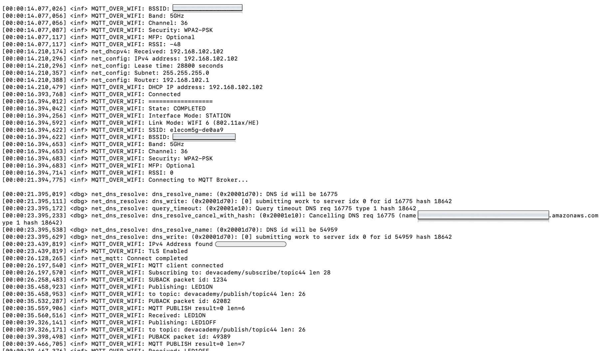

# nRF7002

2023/04月現在までのまとめ（今後変わる可能性アリ  

## Wi-Fi (2.4GHz or 5GHz)
待望のWi-FiモジュールとDevelopment Kitがリリースされました。  
nRF7002です！ Wi-Fi 5GHz！！！  

これで Bluetooth / Zigbee / OpenThread / ANT / Celler / Wi-Fi の開発が nRF Connect SDK でできるようになりました！  
（さらに nRF Connect SDK v2.0 からは IDE が VSCode になりました！今風！！！）

## nRF7002-DK
nRF7002-DK には nRF7002 のWi-Fiモジュールと、nRF5340 のモジュールが搭載されています。  
で、今回のnRF7002 の Wi-Fi モジュールは コンパニオンIC となっていて、ホストIC となる nRF5340 と QSPI(メッチャ速いSPI)で接続されています！  
  
nRF9160 での開発経験がほぼそのまま活かせます。  

  

### AWSへの接続も超簡単

  

何も考えなくても、nRF9160 で作った MQTT のサンプルと、Wi-Fi Station のサンプルを組み合わせるだけで簡単にAWS IoT Core が出来てしまうので、これ以上何も書くことが無いくらいです。  
　　

Let's enjoy !
