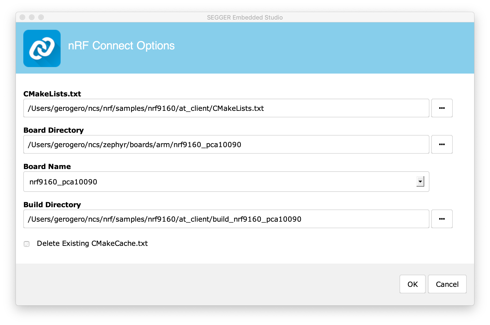
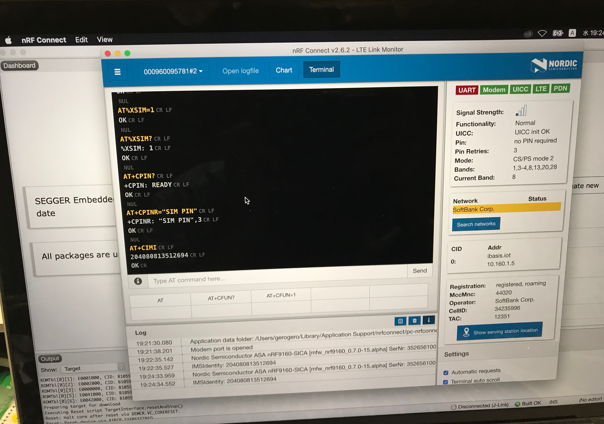
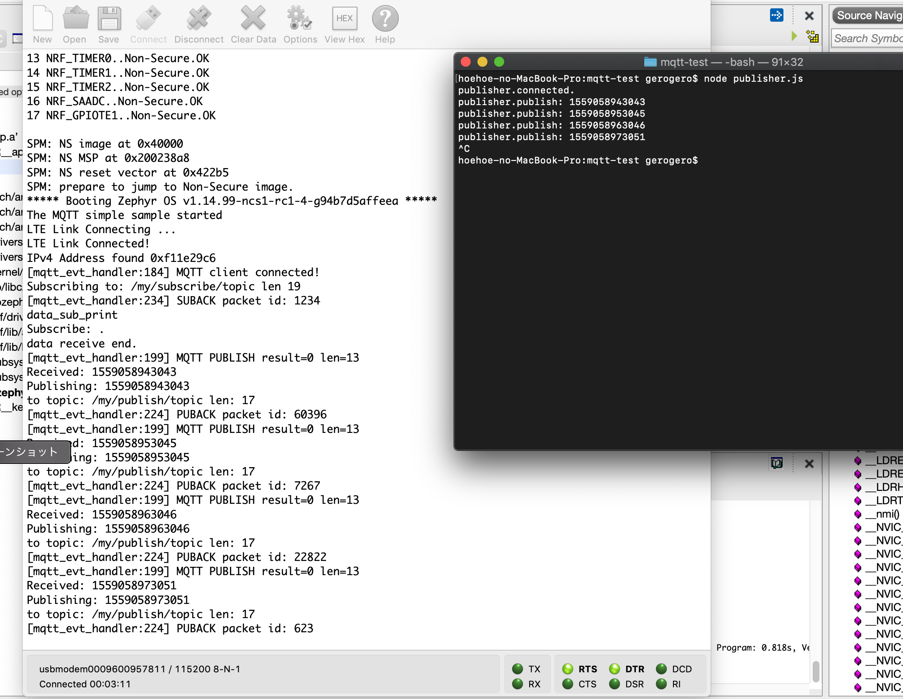
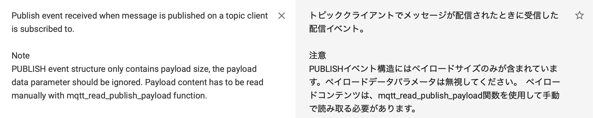
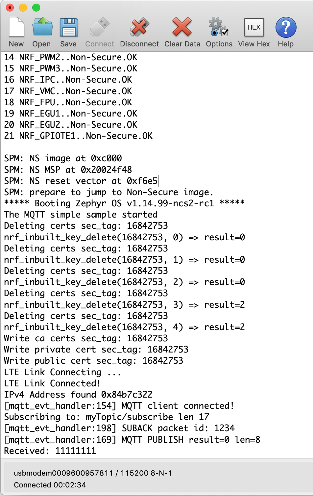
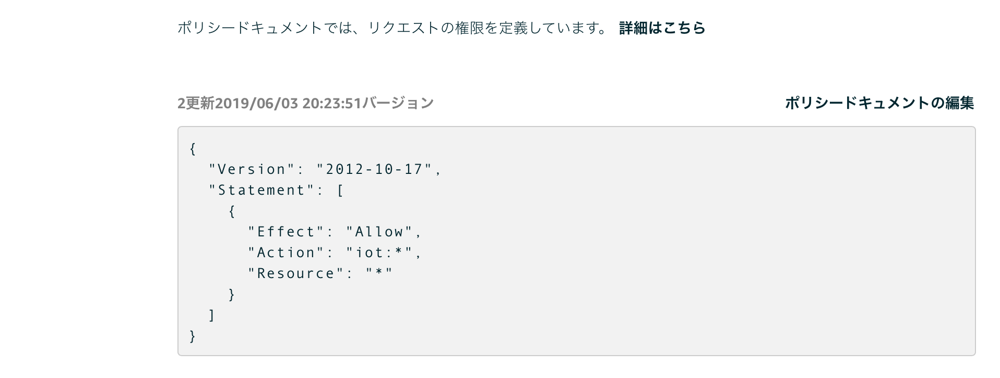

# nRF9160

2019/06月現在までのまとめ（今後変わる可能性アリ  

## ATコマンドを動かすまで

### セットアップ
macOSで。Windowsなんて知らない。ninja走らないWindowsなんて知らない  
Pythonは3.7.x

モデムのファームウェアが新しいの（常に最新バージョンのモデムのファームウェアで更新すること）出てるんで、アップデートしといて。[ mfwnrf916007029alpha ](https://www.nordicsemi.com/Software-and-Tools/Development-Kits/nRF9160-DK/Download#infotabs)  

~~Zephyr RTOSをインストール済みの場合、westがコンフリクトするので新規にローカル管理者アカウントを作成のこと~~  
SESはNordicのドキュメントにある方のヤツ。Segger からDLするヤツはNG。  

ちゃんとドキュメント見てセットアップして。[nRF_Connect_SDK](https://developer.nordicsemi.com/nRF_Connect_SDK/doc/latest/nrf/index.html)  
brew で dtsとかcmakeとかninjaとか色々入れといて。ちゃんとドキュメントに書いてあるから
(nRF Connect Desktopにセットアップチュートリアルも入っているので、その指示に従いながら順番に)  


### westでnRF Connect SDKをセットアップできたら
west init で nRF Connect SDKをダウンロードしてきたら、west updateする  

プロジェクトをSESのアイコンをダブルクリックで普通に開くと、cmakeが走らなくてエラーになるので、SESのAppの「パッケージの内容を表示」 -> Contents/MacOS/emStudioを直接ダブルクリックして開く。Terminalからでも可  

GCC-ARMのバージョンに注意  

```
hoehoe-no-MacBook-Pro:~ gerogero$ /usr/local/gnuarmemb/bin/arm-none-eabi-gcc --version
arm-none-eabi-gcc (GNU Tools for Arm Embedded Processors 7-2018-q2-update) 7.3.1 20180622 (release) [ARM/embedded-7-branch revision 261907]
Copyright (C) 2017 Free Software Foundation, Inc.
This is free software; see the source for copying conditions.  There is NO
warranty; not even for MERCHANTABILITY or FITNESS FOR A PARTICULAR PURPOSE.
```

``` ~/.bash_profile
export ZEPHYR_TOOLCHAIN_VARIANT=gnuarmemb
export GNUARMEMB_TOOLCHAIN_PATH=/usr/local/gnuarmemb

set PATH=$PATH:/usr/local/bin
export PATH
```


### ncs/nrf/samples/nrf9160/at_client

~~SecureBootがSPMという名前に変わったので prj.confには CONFIG_SPM=y を追記しておく~~  
SESでプロジェクトを開くときにBoard Nameを nrf9160_pca10090nsを指定する。  

```prj.conf
# General config
CONFIG_ASSERT=y
CONFIG_TEST_RANDOM_GENERATOR=y
#CONFIG_SPM=y
#CONFIG_STDOUT_CONSOLE=y

# Network
CONFIG_NETWORKING=y
CONFIG_NET_SOCKETS=y
CONFIG_NET_SOCKETS_OFFLOAD=y

# BSD library
CONFIG_BSD_LIBRARY=y

# AT host library
CONFIG_AT_HOST_LIBRARY=y
CONFIG_UART_INTERRUPT_DRIVEN=y

# Stacks and heaps
CONFIG_MAIN_STACK_SIZE=4096
CONFIG_HEAP_MEM_POOL_SIZE=1024

```

もし ArduinoでnRF5x なBLEの環境がインストールされていると、PATHの関係でnrfjprogがコンフリクトするので、Adafruitとかのライブラリがあったら全部アンインストールして消しといて。  
インストーラーで消えない場合もあるから、Libraryに入ってるやつ手動で消して  


### SESでプロジェクト開いて

  
(Board Nameはnrf9160_pca10090nsを指定)  


### ビルドする

zephyr.hex ではなく、SPM込みでビルドになるため merged.hex が生成されている点に注意  
merged.hexの場所は at_client/build_nrf9160_pca10090ns/zephyr の中  


Flashのやり方は、メニューバーの  
Target -> Connect J-Link   
Target -> Download File -> Download Intel Hex   

で merged.hex を指定 （MacだとJ-Linkで書き込むときに1回目は target failureとなるので、もう1回書き込む。2回目にファームウェアが焼ける）  

~~その状態でnRF Connectアプリの LTE Link Monitorを開くとエラーがいっぱい出るなら、SPMのプロジェクトもビルドしてそっちは普通にBuild and Run で Flash してみて~~

LTE Link Monitor 開いたら、ちゃんとDKボードのリセットボタン押してbootすることを確認する  

UARTがなんで赤なのかは分かんないけど、田舎だとSoftbankに繋がった  
iBasisのSIMカードは nRF CloudドットコムのWEBからRegistrationをお忘れなく  
iBasisのeSIMはSoftBankもしくはNTT Docomoのどちらかに繋がるし、Network一覧に両方出る  

NordicのDevZoneとYoutube チャンネル見れば出来るからそれみて  


  

# nRF9160 ( もきゅっと編 ) 

nRF Connect SDK のサンプルにある mqtt_simple.  



動かすとこんな感じ。  

publisher は Node.js®︎, Subscriber が nRF9160, broker は iot.eclipse.org  


### Publisher

```publisher.js
//publisher.js
'use strict';

const mqtt = require('mqtt');
const client = mqtt.connect('mqtt://iot.eclipse.org');

client.on('connect', () => console.log('publisher.connected.'));

setInterval(() => {
    const message = Date.now().toString();
    client.publish('/my/subscribe/topic', message);
    console.log('publisher.publish:', message);
}, 1000*10);
```

Terminalで node publisher.js すると10秒ごとにpublish  


### Subscriber

```prj.conf
# General config
CONFIG_TEST_RANDOM_GENERATOR=y
CONFIG_CONSOLE=y
CONFIG_CONSOLE_HAS_DRIVER=y
CONFIG_STDOUT_CONSOLE=y

# Networking
CONFIG_NETWORKING=y
CONFIG_NET_SOCKETS_OFFLOAD=y
CONFIG_NET_SOCKETS=y
CONFIG_NET_SOCKETS_POSIX_NAMES=y

# LTE link control
CONFIG_LTE_LINK_CONTROL=y
CONFIG_LTE_AUTO_INIT_AND_CONNECT=n

# BSD library
CONFIG_BSD_LIBRARY=y

# AT Host
CONFIG_UART_INTERRUPT_DRIVEN=y
CONFIG_AT_HOST_LIBRARY=y

# MQTT
CONFIG_MQTT_LIB=y
CONFIG_MQTT_LIB_TLS=n

# Appliaction
CONFIG_MQTT_PUB_TOPIC="/my/publish/topic"
CONFIG_MQTT_SUB_TOPIC="/my/subscribe/topic"
CONFIG_MQTT_CLIENT_ID="hoehoegerogero1234"
CONFIG_MQTT_BROKER_HOSTNAME="iot.eclipse.org"
CONFIG_MQTT_BROKER_PORT=1883

# Main thread
CONFIG_MAIN_THREAD_PRIORITY=7
CONFIG_MAIN_STACK_SIZE=4096

CONFIG_HEAP_MEM_POOL_SIZE=1024
```

```main.c
/**@brief MQTT client event handler
 */
void mqtt_evt_handler(struct mqtt_client *const c,
		      const struct mqtt_evt *evt)
{
	int err;

	switch (evt->type) {
	case MQTT_EVT_CONNACK:
		if (evt->result != 0) {
			printk("MQTT connect failed %d\n", evt->result);
			break;
		}

		connected = true;
		printk("[%s:%d] MQTT client connected!\n", __func__, __LINE__);
		subscribe();
		break;

	case MQTT_EVT_DISCONNECT:
		printk("[%s:%d] MQTT client disconnected %d\n", __func__,
		       __LINE__, evt->result);

		connected = false;
		break;

	case MQTT_EVT_PUBLISH: {
		const struct mqtt_publish_param *p = &evt->param.publish;

		printk("[%s:%d] MQTT PUBLISH result=%d len=%d\n", __func__,
		       __LINE__, evt->result, p->message.payload.len);
		err = publish_get_payload(c, p->message.payload.len);
		if (err >= 0) {
			data_print("Received: ", payload_buf,
				p->message.payload.len);
			/* Echo back received data */
			data_publish(&client, MQTT_QOS_1_AT_LEAST_ONCE,
				payload_buf, p->message.payload.len);
		} else {
			printk("mqtt_read_publish_payload: Failed! %d\n", err);
			printk("Disconnecting MQTT client...\n");

			err = mqtt_disconnect(c);
			if (err) {
				printk("Could not disconnect: %d\n", err);
			}
		}
	} break;

･･･省略･･･

	default:
		printk("[%s:%d] default: %d\n", __func__, __LINE__,
				evt->type);
		break;
	}
}
```

- mainの処理でLTE初期化 -> LTE接続 -> もきゅっと初期化 -> もきゅっと接続 -> Subscribe -> mainループ  
  
- mqtt_evt_handler で MQTT_EVT_PUBLISH が飛んできたらデータを表示して、受け取ったデータをエコーバック処理としてpublish  
  
### 補足

nRF Connect SDKはベースがZephyr RTOSとなっており、もきゅっとのヘッダーファイルなんかはZephyrの方にあるます。  
んで、zephyrの <net/mqtt.h> を見てみると、mqtt_evt_type があって MQTT_EVT_PUBLISH に  



と書かれています。  
Subscribeされた時にイベントとして飛んでくるのかと思い込んでいたので、どハマりました。  
あと、publisherのtopic指定も間違えていたので、２箇所ハマりました。  

あ、mqtt_simpleの場合は プロジェクトの Board Name を nrf9160_pca10090ns と指定して開いた後ビルドしないと今はダメなようです。ご注意ください。  


## AWS IoT Core



DevZoneで聞いてる人が居たので、やってみたらエラーバンバン。  
SORACOM Beamの方が良くないかなぁと思っていたら、Nordicの中の人から[GitHub](https://github.com/joakimtoe/fw-nrfconnect-nrf/commit/36532a8ca60bf7139a988b5cbb4e6cb47948a9fa)にあるよ〜って教えてもらえました。  

AssetsTrackerのアプリケーションを見ていたら MQTT TLS Socket なんだろうかと思っていたら、MQTT TLSのオプションを有効にすれば良いみたい。  

AWS IoT Coreのポリシー設定は Allow * で全部通すように。  


Zephyr RTOS / nRF Connect SDK は、設定が完璧なら完璧に動作するところがポイント高いですね。  

必要な情報は大体全てNordic semi. の [DevZone](https://devzone.nordicsemi.com) にありますので、頑張ってね。  
  
# 追伸 2021-04-02  
やっぱ SORACOM のSIM挿して Beam しとけばいいや。  


