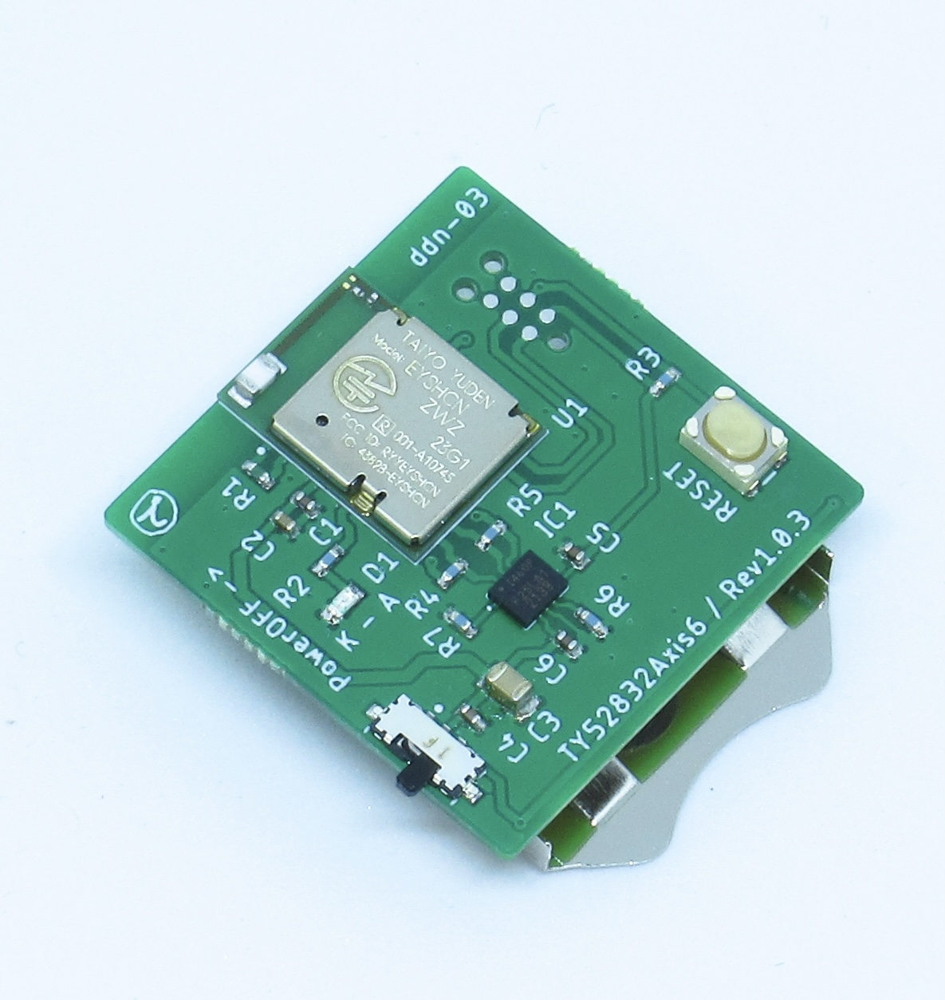

# TY52832Axis6

### 商品説明
  

  - 26.5mm x 26.5mm のふつうのサイズの BLE / Bluetooth5 ®︎ 開発用基板です。  
  - ６軸センサー（加速度・ジャイロ）搭載で、CR2032 コイン電池１つで動きます。  

### スペック
  - Bluetooth 5.0 ®︎ MCU: EYSHCNZWZ ( nRF52832 Cortex M4F 64KB RAM / 512KB flash)  
  - ６軸センサー : Invensense ICM-42670P ( ３軸加速度、３軸ジャイロ、Digital Motion Processor™　 ) 搭載  

  - 動作時間： デフォルトのファームウェアで 120 時間程度 連続稼働  
  - 消費電力： デフォルトのファームウェアでおよそ 1.8mAh（ DCDC 有効時 1.7V 〜 3V まで稼働可能）  

### デフォルトファームウェアの出力データ
  - 加速度  
  - ジャイロ（角速度）  
  - クォータニオン（四元数）  

### ファームウェア・ソースコード
[peripheral_icm42670.zip](./hex_and_source/peripheral_icm42670.zip)  

### iOSアプリケーション・サンプルコード
[SC_Box](./hex_and_source/SC_Box.zip)  

### 販売先
[BASE](https://dedendendede.base.shop/items/41904798) で売ってます。  

