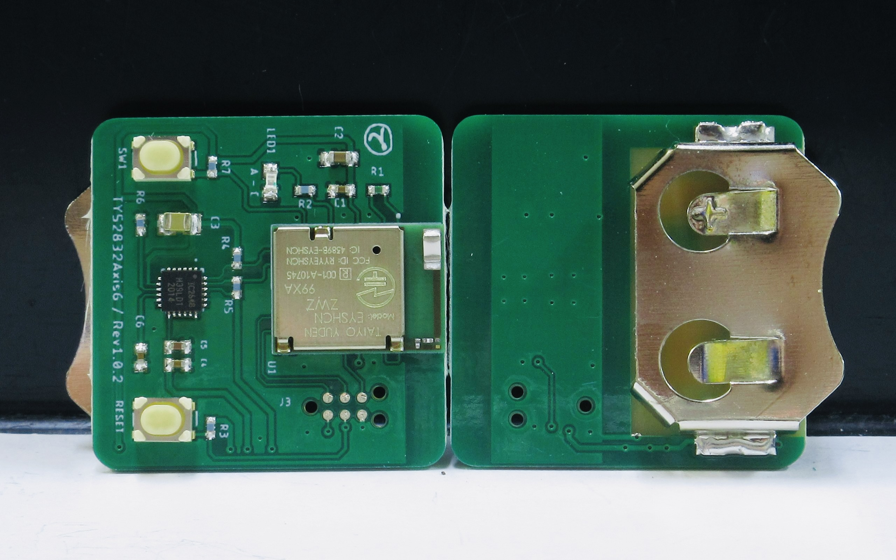
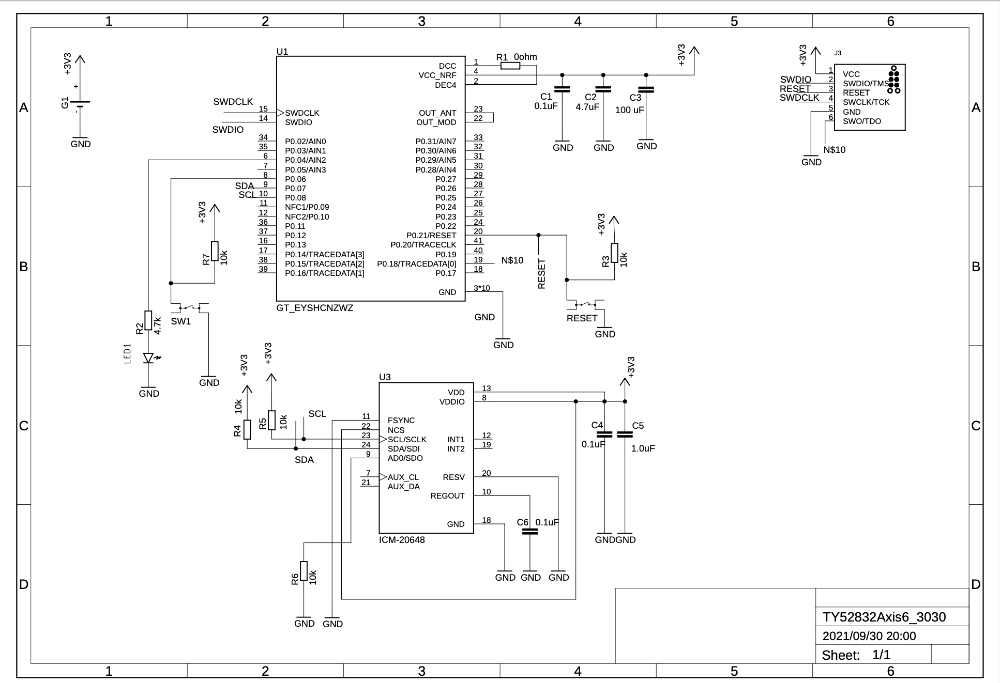
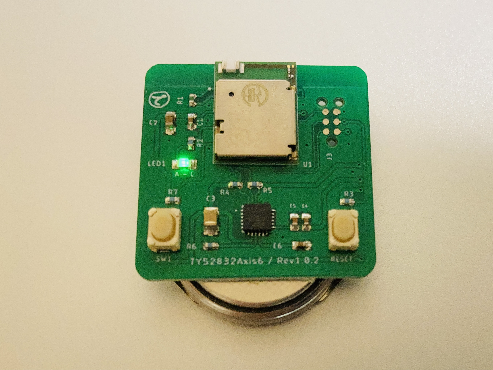

# TY52832Axis6

### 商品説明
  

  - 26.5mm x 26.5mm のふつうのサイズの BLE / Bluetooth5 ®︎ 開発用基板です。  
  - ６軸センサー（加速度・ジャイロ）搭載で、CR2032 コイン電池１つで動きます。  

### スペック
  - Bluetooth 5.0 ®︎ MCU: EYSHCNZWZ ( nRF52832 Cortex M4F 64KB RAM / 512KB flash)  
  - ６軸センサー : Invensense ICM-20648 ( ３軸加速度、３軸ジャイロ、Digital Motion Processor™　 ) 搭載  

  - 動作時間： デフォルトのファームウェアで 120 〜 144 時間程度 連続稼働  
  - 消費電力： デフォルトのファームウェアでおよそ 1.52mAh（DMP OFF） 〜 1.8mAh ( DMP ON ) DCDC 有効時 1.7V 〜 3V まで稼働可能  

### センサーからの出力データ
  - 加速度  
  - ジャイロ（角速度）  
  - クォータニオン（四元数）  
  - 線形加速度  
  - 歩数検知  
  - 歩数  

デフォルトのファームウェアでは、この内 STEP Detect 以外のパラメータをモード切り替え( BLE Write で characteristic に書き込み )した後に BLE / Bluetooth5 ®︎ で送信可能になります。  

### ハードウェアの回路図
  

### ファームウェア
[ble_app_icm20648_s132.hex](./hex_and_source/ble_app_icm20648_s132.hex)  
[zephyr.hex](./hex_and_source/zephyr.hex)  

### ファームウェア・ソースコード
[ble_app_icm20648.zip](./hex_and_source/ble_app_icm20648.zip)  
[peripheral_ty52832axis6.zip](./hex_and_source/peripheral_ty52832axis6.zip)  

### iOSアプリケーション・サンプルコード
[SC_Box](./hex_and_source/SC_Box.zip)  

### 使い方
  

  - 裏面にある電池ホルダーに CR2032 のコイン電池をセットします  
  - LEDが５秒程度点灯し、消灯したらBluetooth と センサーが稼働します  
  - スマートフォンアプリとデバイスがBluetooth接続し、通信を開始する( Notification がON になる )とLEDが点滅します  
  
  - 基板上の向かって右手側のボタンがリセットボタン。左手側はユーザーがファームウェア内で任意に機能を割り当て出来るボタン（回路図上では SW1 です）となっています  
  - SW1 のボタンにはデフォルトで、『長押し３秒で Power OFF 機能』を割り当ててあります。  
  - 動作中に電池が消耗し LEDの点滅が消えても Bluetoothとセンサーはしばらく動き続けますので、LEDが消えていても、まだしばらくは動くかも知れません。  

### 販売先
[BASE](https://dedendendede.base.shop/items/41904798) で売ってます。  

