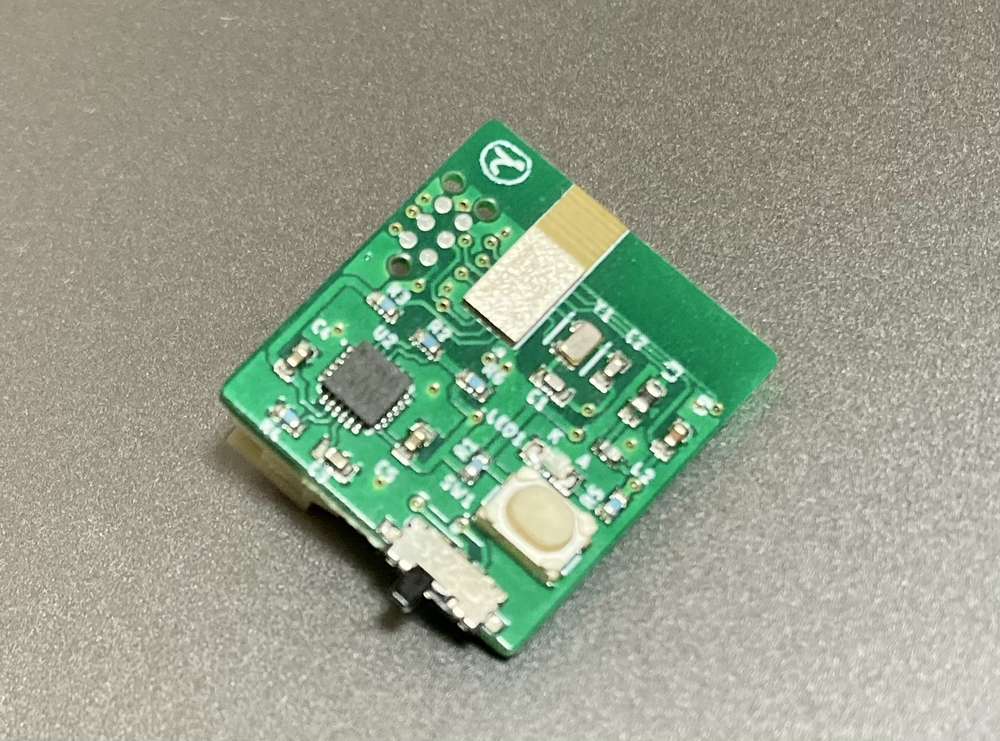
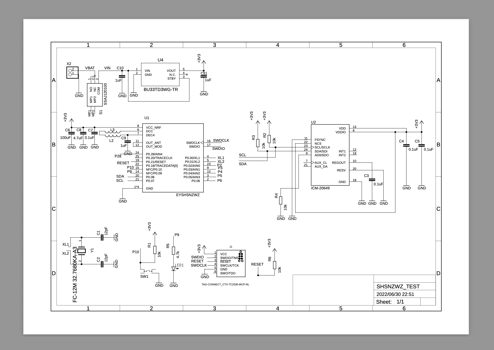

# TY52832Axis6_UltraSmall

### 商品説明
  

  - 18mm x 20mm の超小型 Bluetooth5 ®︎ 開発用基板です。  
  - ６軸センサー（加速度・ジャイロ）搭載 Li-poバッテリーで動きます。  

### スペック
  - Bluetooth 5.0 ®︎ MCU: EYSHSNZWZ ( nRF52832 Cortex M4F 64KB RAM / 512KB flash)  
  - ６軸センサー : Invensense ICM-20649 ( ３軸加速度、３軸ジャイロ、Digital Motion Processor™　 ) 搭載  

  - 動作時間： デフォルトのファームウェア / 110mAh のLi-poバッテリで 100 時間程度 連続稼働  
  - 消費電力： デフォルトのファームウェア / 110mAh のLi-poバッテリでおよそ 1.1mAh ( DMP ON ) DCDC 有効時 1.7V 〜 3V まで稼働可能  

### センサーからの出力データ
  - 加速度  
  - ジャイロ（角速度）  
  - クォータニオン（四元数）  
  - 線形加速度  
  - 歩数検知  
  - 歩数  

デフォルトのファームウェアでは、この内 加速度・ジャイロ・クォータニオンを Bluetooth5 ®︎ で送信可能になります。  

### ハードウェアの回路図
  

### ファームウェア

### ファームウェア・ソースコード

### iOSアプリケーション・サンプルコード
[SC_Box](./hex_and_source/SC_Box.zip)  

### 使い方
  

  - 裏面にあるコネクタにLi-poバッテリをセットし、スライドスイッチで電源をONにします  
  - LEDが５秒程度点灯し、消灯したらBluetooth と センサーが稼働します  
  - スマートフォンアプリとデバイスがBluetooth接続し、通信を開始する( Notification がON になる )とLEDが点滅します  
  

### 販売先
[BASE](https://dedendendede.base.shop/) で売り出しします（予定）。  

